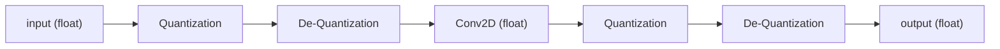
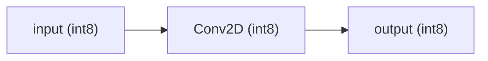
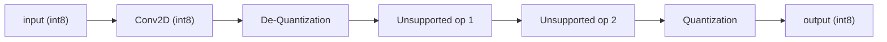

# About Quantization

This guide is under construction

- [ ] Quantization Code implementation 
    - [ ] Pytorch Quantization
        - [ ] Quantization Configuration
            - [ ] FakeQuantize and Observer classes
            - [ ] eager fx and pt2e examples for configuration wrapping classes
        - [ ] Quantization Methods
            - [ ] Eager Mode
                - [ ] Eager mode refactoring for execution
                - [ ] Eager mode PTQ
                    - [ ] Eager mode static
                    - [ ] Eager mode dynamic
                - [ ] Eager mode QAT
            - [ ] FX Symbolic Tracing
                - [ ] FX Symbolic Tracing Refactoring for traceability
            - [ ] PT2E (python 2 export)
                - [ ] PT2E refactoring
                - [ ] PT2E PTQ
                    - [ ] PT2E static
                    - [ ] PT2E dynamic
                - [ ] PT2E QAT
        - [ ] Export method conversion
            - [ ] Eager mode observed to FX 
            - [ ] FX float to PT2E float
            - [ ] FX quantized to PT2E quantized
                - [ ] FX PTQ to PT2E PTQ
                - [ ] FX QAT to PT2E QAT
    - [ ] ONNX
    - [ ] Tensorflow / Keras /TFLite
        - [ ] TF float to PTQ
        - [ ] TF Keras to QAT (tfmot)
            - [ ] Sequential
            - [ ] Functional
- [ ] Backend conversion
    - [ ] Python float to ONNX float
    - [ ] ONNX float to Keras float
    - [ ] Tensorflow / Keras float to Quantized TFLite
    - [ ] Python quantized to ONNX quantized
    - [ ] Python observed QAT to ONNX quantized
    - [ ] Python float to TFLite quantized (ai_edge_torch)
    - [ ] Python quantized to TFLite quantized (ai_edge_torch)

Sources:

- [Pytorch Quantization docs](https://pytorch.org/docs/stable/quantization.html)
- [Pytorch blog: quantization in practice](https://pytorch.org/blog/quantization-in-practice/)
- [ONNX Quantization docs](https://onnxruntime.ai/docs/performance/model-optimizations/quantization.html)
- [Tensorflow Quantization docs](https://ai.google.dev/edge/litert/models/model_optimization?hl=en)
- [Huggingface Quantization docs](https://huggingface.co/docs/transformers/main/en/main_classes/quantization)


## Definition

In computation, quantization is the method to convert calculations from a higher precision but memory and processing heavy format to a lower memory and processing format in exchange of the precision that the higher format has. In most cases when talking about quantization of AI models, machine learning and neural networks, the process refers to converting a model's weights and computations from floating point numbers in 32 bit memory, to the 4 times compressed 8 bit format. This is done not only to save memory of the model itself, but to make it possible to calculate the results faster in lesser equipped hardware. For example, while the model might be trained for hours or days on a GPU with faster processing, the final model might be more usable in smaller or mobile CPU devices if it is quantized in this way. This presents many difficulties and technical knowledge so I prepared this guide for myself and others to use when needed.

## Quantization Affine Transformations, quantization parameters, and 8-bit computations

The process of quantizing a tensor (for example, the weights or the input and output of a neural network node) is done via an [affine transformation](https://en.wikipedia.org/wiki/Affine_transformation), in this case specifically, a scaling and translation transformation. Scaling is done to reduce the range of possible 32 bit numbers (`2^32=4294967296` values) to the 8 bit range (`2^8=256` values). Scaling the whole range, however, would be not only inefficient but most of the information would be lost. There needs to be a relevant minimum and maximum value that can be mapped to the 8 bit range and calculate a scaling factor and then the translation can be given to map the value corresponding to zero to correctly handle positive and negative values during calculations. These values are often referred to as **quantization parameters**, which are often *scale* and *zero point*. There is also *minimum value*, *maximum value* for the observed floating point values to be used in the scaling, and *quantization maximum* and *quantization minimum* to refer to the range of 8 bit values to be used. 

Below I show a visual representation of this:

```python
x = tensor(dtype=float32)
quant_min = 0   # or -128 or -127
quant_max = 255 # or 127
z = zero_point

min_value-----------0-------------max_value
       ↓            ↓             ↓
       quant_min----z----quant_max

```

### Symmetric vs Asymmetric quantization parameters

Depending on the calculation being performed, or the backend specifications ([Pytorch](https://pytorch.org/docs/stable/quantization.html), [ONNXRuntime](https://onnxruntime.ai/docs/), [TFLite](https://ai.google.dev/edge/litert/models/model_optimization?hl=en), [TensorRT](https://developer.nvidia.com/tensorrt), [OpenVINO](https://github.com/openvinotoolkit/openvino), etc.) the quantization range of values and zero point mapping might be preferred to be symmetric or asymmetric. 

For symmetric quantization, the absolute values of the input are used to calculate a maximum value, and then mirrored from 0 to represent the minimum value. This is slightly less efficient in terms of mapping range, since some of the range will be unused, but it will increase calculation speed since the zero point does not need to be determined or considered in the calculations, as it will always map to 0.

Visually represented, the symmetric quantization would be like this:

```python
x = tensor(dtype=float32)
quant_min = -128 # asymmetric range or -127 for symmetric range
quant_max = 127
zero_point = 0

-max(abs(x))-----------0-------------max(abs(x))
          ↓            ↓             ↓
          quant_min----0----quant_max
```

This representation is particularly useful in weighted and biased operations, since the multiplication of quantized values introduces the need to calculate an intermediate zero point for the product before adding any other values.

### Quantization Parameter calculation

To calculate the quantization parameters, as well as the quantized tensor with asymmetric quantization, we use the following formulas:

```python
x = tensor(dtype=float32)

quant_min = 0   # or -128 or -127
quant_max = 255 # or 127

quant_x = round((x / scale) + zero_point).clamp(quant_min, quant_max)
scale = (max(x) - min(x)) / (quant_max - quant_min)

# Solving from formulas:
quant_min = round((min(x) / scale) + zero_point)
zero_point = round(quant_min - (min(x)/scale))
# or
quant_max = round((max(x) / scale) + zero_point)
zero_point = round(quant_max - (max(x)/scale))

z = zero_point

min(x)-----------0-------------max(x)
    ↓            ↓             ↓
    quant_min----z----quant_max


dequant_x = (quant_x - zero_point)*scale


            quant_min----z----quant_max
            ↓            ↓             ↓
approx_min_x-------------0-------------approx_max_x

approx_min_x ~= min(x)
approx_max_x ~= max(x)

```

You will notice that to calculate the quantized value rounding is performed, which then when converted back to a floating point number, loses some accuracy.

Because a model will have numerous layers and calculation, the loss of performance is increased with each layer that is used. To counter this loss in performance, there is usually also a need to reduce the floating point model itself, or to modify the weights to accommodate for this loss. This will be discussed in a later section.

Now, for symmetric quantization, the following formulas are used:

```python
x = tensor(dtype=float32)

quant_min = -128 # asymmetric range or -127 for symmetric range
quant_max = 127
quant_x = round((x / scale)).clamp(quant_min, quant_max)
scale = (2*(max(abs(x)))) / (quant_max - quant_min)
zero_point = 0

-max(abs(x))-----------0-------------max(abs(x))
          ↓            ↓             ↓
          quant_min----0----quant_max

dequant_x = quant_x*scale

                 quant_min----0----quant_max
                 ↓            ↓             ↓
-approx_max_abs_x-------------0-------------approx_max_abs_x

approx_max_abs_x ~= max(abs(x))
```

Notice that the calculations are made simpler as mentioned before.

Now, some backends will use the inverse of the scale formula, to multiply instead of divide by the scale parameter, so one must be careful when trying to replicate a model in a different format.

### Signed and Unsigned quantization ranges

Depending on the backend, some operations can be done on different ranges of the 8-bit representation format.

- Unsigned (asymmetric range): `[0,255]`: 256 values
- Signed asymmetric range: `[-128,127]`: 256 values, zero-point can be wherever.
- Signed symmetric range: `[-127,127]`: 255 values, zero-point is always 0, and is usually used for per-axis calculations in some backends (for example, [TFLite](https://ai.google.dev/edge/litert/models/quantization_spec))


### 16-bit quantization

Some backends will allow for a 16-bit quantization format, which will lower the calculations from the memory heavy 32-bit floating point values to 16-bit floating point values. Because they are still floating point values, less precision is lost, while taking up more calculation power than 8-bit calculations, and not all backends have this implementation, making it a less common option.

### Per-Tensor and Per-Channel / Per-Axis Quantization Schemes

Some operations (but not all) allow for a quantization of a tensor where the parameters are calculated in a more granular manner by using an axis of the tensor as if it were multiple tensors.

For example, in networks that handle 2D image inputs, there are batch, RGB channels, width and height axes. After the input, within the network, the channels don't always represent the colors; however, they are still called channels.

This per-axis or per-channel quantization results in a scaling tensor and a zero point tensor, instead of a single value for each, with a size matching the number of channels in the tensor to be quantized.

The use of per-channel quantization is usually appropriate for the weight tensors, but unless the model is very simple, it is not recommended for input and output quantization (otherwise called activation quantization).

This allows for the range of each channel to not waste space in the 8-bit range when scaling the tensor, since the minimum and maximum values can be different for each of them.

## Static vs Dynamic Quantization modes

Until now, I have discussed the quantization of models by assuming that both the input and output (activation) tensors, as well as weight tensors are quantized. This is called **static** quantization.

While the weight tensors are available in a trained model, the input and output tensors are different with each inference, which makes it so that the parameters can't be calculated directly from the model. To be able to calculate the quantization of input and output parameters, some sort of approximation to the most efficient but still wide enough range of minimums and maximums in the data. This is often done by sending representative data, which is called **calibration**. This is doable for all types of operation layers, but if the data is not representative enough, the model might not perform correctly when new data is introduced. 

However, one can leave the input and output quantization parameters without calculation, and calculate them on the run when using the model. This offers more flexibility with the input, but it introduces more calculations to be done and increases the latency of the model, as well as not being available for all operations, and depending heavily on the backend.

### Choosing a quantization mode

According to the [onnx documentation](https://onnxruntime.ai/docs/performance/model-optimizations/quantization.html#method-selection), it is better to use static quantization for convolutional models, while dynamic quantization is better for transformer based and recursive neural network models. This is, however, not a rule that will fit every case, and in case of desiring faster performance over precision, static quantization is always preferred.

It is also important to note that dynamic quantization applies to Post Training Quantization but not to Quantization Aware Training. The difference between these is explained in a later section.

### Static vs. Dynamic Quantization support

The available operators for static or dynamic quantization differs by each backend. The most used are listed below:

- Pytorch
    - [Pytorch mode recommendation matrix](https://pytorch.org/docs/stable/quantization.html#quantization-mode-support)
        - Dynamic quantization is recommended for LSTM, MLP, Embedding, and Transformer models using Post Training Quantization, but not for Quantization Aware Training.
    - [Pytorch operator support matrix](https://pytorch.org/docs/stable/quantization.html#operator-support)
        - Convolutions don't support dynamic quantization in pytorch.
        - RNN, GRU, LSTM don't support static quantization in pytorch.
        - Multihead Attention is not supported in either quantization mode in pytorch.
- [ONNX quantization method selection](https://onnxruntime.ai/docs/performance/model-optimizations/quantization.html#method-selection)
    - There are suggestions but not a list of supported operators
- [Tensorflow dynamic range quantization docs](https://ai.google.dev/edge/litert/models/post_training_quant?hl=en)


## Post-Training Quantization (PTQ) vs. Quantization Aware Training (QAT)

A model can be quantized during or after being trained fully. Moreover, quantization during training is a more recent development, so most quantization documentation in the past is about quantizing the model after training.

**Post-Training Quantization**, or **PTQ** is used when quantizing the model after training fully, usually referring to *static* or *dynamic* quantization, and in the case of static quantization, uses *calibration* representative data to calculate the quantization parameters. The weights of the model are in this case, unaffected by the quantization process except for the scaling and translation that occurs.

**Quantization Aware Training** or **QAT** is a bit different in that it introduces an object that stores the quantization parameters in between operators, then trains the model while actively registering the new minimums and maximums, calculating the new quantization parameters, and optimizing the weights during back propagation to reduce the loss of the model. Like I mentioned before, the rounding that happens in quantization propagates some reduction in performance, but this can be countered by the adjusting of the weights to a place where the quantization and rounding has less of an effect.

An even more recent development is **Learnable Step-size Quantization** or **LSQ**, where these quantization parameters are not calculated using a minimum or a maximum for each input, output, or weight tensor but instead are part of the learnable parameters adjusted during loss optimization and back propagation. This, however, is not yet widely implemented.

### How recent is QAT and LSQ

For quantization aware training, the earliest I could find in an academic context is [a paper by Jacob et al. in 2017](https://arxiv.org/pdf/1712.05877).
Pytorch has had implementations of quantization since 1.4.0 in 2020, which included QAT (although it has improved greatly since), while Tensorflow implemented a full API for QAT with `tensorflow-model-optimization` 0.3.0 in 2020 as well. This makes the API implementation quite recent, although guides have been more available in the last few years. 

[Learned Step Quantization was introduced by Esser et al. in 2020](https://arxiv.org/pdf/1902.08153), with pytorch [having an undocumented private module implementing it](https://github.com/pytorch/pytorch/blob/main/torch/ao/quantization/_learnable_fake_quantize.py), presumably still under development; and Tensorflow not having this implementation yet as of 2024-09.


## QDQ representation format

While there are quantized operations defined in each backend that correspond to the actual quantized tensors being used for calculation, it is difficult to match all of them when converting from format to format, as well as impractical for developers to know which quantized operations correspond to which float counterparts. It is also not necessary to have these until the model is fully quantized, and there is the need to have an intermediate representation when calibrating or training models that represents the quantization process but keeps the values as floating point values for using in the next operation. This representation consists of an operation, a quantization of the output and a dequantization of the output, followed by the next operation. 

This is often called a **QDQ** representation (Q: quantization, DQ: Dequantization).



Which is then interpreted by the backend and replaced with quantized versions of the nodes:



This allows for easier conversion between backends but it also allows for nodes where quantization is unsupported to be inserted in the model without much issue.

```mermaid
graph LR
    I["input (float)"] -->
    QA[Quantization] -->
    DA[De-Quantization] -->
    C["Conv2D (float)"] -->
    QB[Quantization] -->
    DB[De-Quantization] -->
    U1[Unsupported op 1] -->
    U2[Unsupported op 2] -->
    QC[Quantization] -->
    DC[De-Quantization] -->
    O["output (float)"]
```





## Quantization Code implementation

### Pytorch Quantization

Sources:

- [Pytorch Quantization docs](https://pytorch.org/docs/stable/quantization.html)
- [Pytorch BackendConfig Tutorial](https://pytorch.org/tutorials/prototype/backend_config_tutorial.html)
- [Pytorch Eager Mode PTQ Static Quantization Tutorial](https://pytorch.org/tutorials/advanced/static_quantization_tutorial.html)
- [Pytorch Eager Mode PTQ Dynamic Quantization example LSTM](https://pytorch.org/tutorials/advanced/dynamic_quantization_tutorial.html?highlight=lstm)
- [Pytorch FX Quantization user guide](https://pytorch.org/tutorials/prototype/fx_graph_mode_quant_guide.html)
- [Pytorch FX PTQ Static Quantization Tutorial](https://pytorch.org/tutorials/prototype/fx_graph_mode_ptq_static.html)
- [Pytorch FX PTQ Dynamic Quantization Tutorial](https://pytorch.org/tutorials/prototype/fx_graph_mode_ptq_dynamic.html)
- [Pytorch 2 Export Tutorial](https://pytorch.org/tutorials/intermediate/torch_export_tutorial.html)
- [Pytorch 2 Export Quantization Tutorial](https://pytorch.org/tutorials/prototype/quantization_in_pytorch_2_0_export_tutorial.html)
- [Pytorch 2 Export QAT Tutorial](https://pytorch.org/tutorials/prototype/pt2e_quant_qat.html)
- [Pytorch 2 torch compile](https://pytorch.org/tutorials/intermediate/torch_compile_tutorial.html)

Throughout the development of quantization API in pytorch there has been 3 major methods:

- **Eager Mode quantization**: The Eager Mode model (a model left as written in the class definition) is executed directly, along with quantization stubs if present.
    - This method relies on refactoring the model in such a way that the added quantization and dequantization operations are manually written inside the model.
    - This method requires a high-level knowledge of the compatibility of each operation with quantization, and it is prone to errors and missed optimizations.
- **FX Graph Mode quantization**: An FX Graph is a trace of the operations of the model ahead of time (AoT). When quantizing an FX model, quantization nodes are simply added automatically to the model.
    - This method relies on the model being traceable in a consistent way with proxy (not real) tensors. `for` loops, `if` conditions, and other operations that rely on the proxy tensor being a real tensor cannot be traced, so the model needs to be refactored.
    - Quantization is not the only thing that can be added programmatically to the model, and modules can easily be replaced if necessary.
    - Finally, the model is translated to TorchScript code, so code that is traceable with FX graphs but not compatible with TorchScript translation also needs to be refactored.
    - Tracing can be done at operation or module level, and the modules stay within the model.
- **Pytorch 2 Export (PT2E) mode quantization**: Pytorch 2 Export (PT2E) introduced a new way of tracing the model in its lowest pytorch operators using Torch Dynamo instead.
    - More thorough than FX graph mode tracing, but still won't allow certain code that is untraceable. Most models don't need any refactoring when using this mode.
    - Since it is traced at an operation instead of a module level, the model is entirely flattened, so post-tracing modification is more granular, and therefore, more advanced.
    - Since it is traced at an operation instead of a module level, it is more easily converted to other backends.
    
Each of them has its benefits (although eager mode is the least versatile and hardest to do correctly), and the way to implement them all is different. In all cases, some refactoring of the model might be needed, depending on compatibility issues.

#### Quantization Configuration

Pytorch handles the calculation of quantization parameters, as well as the different types of quantization, and the compatibility of quantizeable and non-quantizeable operations with a *Quantization Configuration*, as well as a *Backend Configuration* for earlier methods or a unified *Quantizer* for the PT2E methods. It can determine if the quantization is to 8-bits, what the range of values will be, if it will be symmetric or asymmetric, per-tensor or per-channel, static or dynamic, etc.

The configuration is responsible for determining where to input a *fake quantization* and *observer* modules in the earlier methods, or a quantization and dequantization operation in the PT2E methods.

While the introduced objects are different, it is basically performing a similar task, which I will explain in the following section.

##### FakeQuantize and Observer classes

The [`torch.ao.quantization.fake_quantize.FakeQuantize`](https://pytorch.org/docs/stable/generated/torch.ao.quantization.fake_quantize.FakeQuantize.html) class is a module that encapsulates a quantize and dequantize operation for a given input, following a previous operation or input. It is basically keeping the values as floating point values while introducing the loss in performance that would occur were the model already quantized. Therefore, it is a fake quantization, and not a real one. This is also explained above in the [QDQ representation section](#qdq-representation-format). Inside it there is a [`torch.ao.quantization.observer`](https://pytorch.org/docs/stable/quantization-support.html#torch-ao-quantization-observer) module, which keeps record of the relevant values to generate the quantization parameters.

In the case of Eager mode quantization, these classes are added within the marked quantizeable areas for each module depending on the backend configuration. In the case of FX Graph Mode quantization, these classes are added for all traced nodes depending on the backend configuration. In the case of PT2E mode quantization, it depends on annotation methods registered to the Quantizer.

The type of observer also determines the kind of calculation for quantization parameters that will be made.

Currently the following are available:

Observer class                                                                                                                                                                                                                    | Description                                                                                                                                          |
----------------------------------------------------------------------------------------------------------------------------------------------------------------------------------------------------------------------------------|------------------------------------------------------------------------------------------------------------------------------------------------------|
[ObserverBase](https://pytorch.org/docs/stable/generated/torch.ao.quantization.observer.ObserverBase.html#torch.ao.quantization.observer.ObserverBase)                                                                            | Base observer Module.                                                                                                                                |
[MinMaxObserver](https://pytorch.org/docs/stable/generated/torch.ao.quantization.observer.MinMaxObserver.html#torch.ao.quantization.observer.MinMaxObserver)                                                                      | Observer module for computing the quantization parameters based on the running min and max values.                                                   |
[MovingAverageMinMaxObserver](https://pytorch.org/docs/stable/generated/torch.ao.quantization.observer.MovingAverageMinMaxObserver.html#torch.ao.quantization.observer.MovingAverageMinMaxObserver)                               | Observer module for computing the quantization parameters based on the moving average of the min and max values.                                     |
[PerChannelMinMaxObserver](https://pytorch.org/docs/stable/generated/torch.ao.quantization.observer.PerChannelMinMaxObserver.html#torch.ao.quantization.observer.PerChannelMinMaxObserver)                                        | Observer module for computing the quantization parameters based on the running per channel min and max values.                                       |
[MovingAveragePerChannelMinMaxObserver](https://pytorch.org/docs/stable/generated/torch.ao.quantization.observer.MovingAveragePerChannelMinMaxObserver.html#torch.ao.quantization.observer.MovingAveragePerChannelMinMaxObserver) | Observer module for computing the quantization parameters based on the running per channel min and max values.                                       |
[HistogramObserver](https://pytorch.org/docs/stable/generated/torch.ao.quantization.observer.HistogramObserver.html#torch.ao.quantization.observer.HistogramObserver)                                                             | The module records the running histogram of tensor values along with min/max values.                                                                 |
[PlaceholderObserver](https://pytorch.org/docs/stable/generated/torch.ao.quantization.observer.PlaceholderObserver.html#torch.ao.quantization.observer.PlaceholderObserver)                                                       | Observer that doesn't do anything and just passes its configuration to the quantized module's .from_float(). It is used in dynamic quantization.     |
[RecordingObserver](https://pytorch.org/docs/stable/generated/torch.ao.quantization.observer.RecordingObserver.html#torch.ao.quantization.observer.RecordingObserver)                                                             | The module is mainly for debug and records the tensor values during runtime.                                                                         |
[NoopObserver](https://pytorch.org/docs/stable/generated/torch.ao.quantization.observer.NoopObserver.html#torch.ao.quantization.observer.NoopObserver)                                                                            | Observer that doesn't do anything and just passes its configuration to the quantized module's .from_float().                                         |
[FixedQParamsObserver](https://github.com/pytorch/pytorch/blob/1266be21f45e91eac32e37f9a7258a14270eab15/torch/ao/quantization/observer.py#L1384)                                                                                  | An undocumented observer used in operations where there is no need for variable quantization parameters.                                             |


There is also more than just one [fake_quantize]() class:

Fake Quantize class                                                                                                                                                                                                 | Description                                                                                                                                       |
--------------------------------------------------------------------------------------------------------------------------------------------------------------------------------------------------------------------|---------------------------------------------------------------------------------------------------------------------------------------------------|
[FakeQuantizeBase](https://pytorch.org/docs/stable/generated/torch.ao.quantization.fake_quantize.FakeQuantizeBase.html#torch.ao.quantization.fake_quantize.FakeQuantizeBase)                                        | Base fake quantize module.                                                                                                                        |
[FakeQuantize](https://pytorch.org/docs/stable/generated/torch.ao.quantization.fake_quantize.FakeQuantize.html#torch.ao.quantization.fake_quantize.FakeQuantize)                                                    | Simulate the quantize and dequantize operations in training time.                                                                                 |
[FixedQParamsFakeQuantize](https://pytorch.org/docs/stable/generated/torch.ao.quantization.fake_quantize.FixedQParamsFakeQuantize.html#torch.ao.quantization.fake_quantize.FixedQParamsFakeQuantize)                | Simulate quantize and dequantize in training time. It is fixed for a specific value range for operations without variable output range.           |
[FusedMovingAvgObsFakeQuantize](https://pytorch.org/docs/stable/generated/torch.ao.quantization.fake_quantize.FusedMovingAvgObsFakeQuantize.html#torch.ao.quantization.fake_quantize.FusedMovingAvgObsFakeQuantize) | A fused module to observe the tensor. It is used in PT2E quantization.                                                                            |
[_LearnableFakeQuantize](https://github.com/pytorch/pytorch/blob/main/torch/ao/quantization/_learnable_fake_quantize.py)                                                                                            | An undocumented private class that implements LSQ. It is presumably under development on the latest version at the time of writing (torch v2.5.0) |


##### Eager, FX and PT2E examples for configuration wrapping classes


###### BackendConfig and BackendPatternConfig


###### About fused modules


###### Eager Mode QConfig

Sources:

- [Pytorch Quantization docs](https://pytorch.org/docs/stable/quantization.html)
- [Pytorch BackendConfig Tutorial](https://pytorch.org/tutorials/prototype/backend_config_tutorial.html)
- [Pytorch Eager Mode PTQ Static Quantization Tutorial](https://pytorch.org/tutorials/advanced/static_quantization_tutorial.html)
- [Pytorch Eager Mode PTQ Dynamic Quantization example LSTM](https://pytorch.org/tutorials/advanced/dynamic_quantization_tutorial.html?highlight=lstm)
- [Pytorch API docs: QConfig](https://pytorch.org/docs/stable/generated/torch.ao.quantization.qconfig.QConfig.html)]

[QConfig](https://pytorch.org/docs/stable/generated/torch.ao.quantization.qconfig.QConfig.html) was the first class in pytorch to be implemented for configuring Eager Mode modules.

It is applied to a module directly by adding it to the `torch.nn.Module.qconfig` attribute. Applying it globally to the entire model is often done in Eager mode quantization when the quantization and dequantization submodules are set correctly.

Example:

```python
import torch
from torch.ao.quantization.qconfig import QConfig
from torch.ao.quantization.observer import MinMaxObserver, PerChannelMinMaxObserver

class ExampleModel(torch.nn.Module):
    '''
    Expects mnist input of shape (batch,3,28,28)
    '''
    def __init__(self):
        super().__init__()
        self.quant = torch.ao.quantization.QuantStub()
        self.dequant = torch.ao.quantization.DeQuantStub()
        self.conv = torch.nn.Conv2d(3,10,1,1)
        self.pool = torch.nn.AdaptiveMaxPool2d((1,1))
        # self.pool = torch.nn.MaxPool2d(28,28)
    def forward(self,x):
        x = self.quant(x)
        x = self.conv(x)
        x = self.pool(x)
        x = torch.argmax(x)
        x = self.dequant(x)
        return x

my_model.qconfig = QConfig(
    activation=MinMaxObserver.with_args(
        dtype=torch.quint8,
        qscheme=torch.per_tensor_affine,
        ),
    weight=PerChannelMinMaxObserver.with_args(
        dtype=torch.qint8,
        qscheme=torch.per_tensor_symmetric,
        ),
    )
```

\**Note: The example model in this code is extremely simple and will not have good results, but is used just for showing a functioning program.*

The model is then configured and ready for the FakeQuantize and Observer insertion during the quantization process described later.

Note that the [tutorials](https://pytorch.org/tutorials/advanced/static_quantization_tutorial.html) will use a default QConfig:

```python
import torch

print(torch.ao.quantization.get_default_qconfig('x86'))
'''
QConfig(
    activation=functools.partial(<class 'torch.ao.quantization.observer.HistogramObserver'>,
        reduce_range=True
        ){},
    weight=functools.partial(<class 'torch.ao.quantization.observer.PerChannelMinMaxObserver'>,
        dtype=torch.qint8,
        qscheme=torch.per_channel_symmetric
        ){}
    )
'''
```

This works fine in pytorch but when considering other backends to convert the model to, is not necessarily what we want.

###### FX Mode QConfigMapping

###### PT2E Quantizer


#### Quantization Methods

##### Eager Mode

###### Eager mode refactoring for execution

###### Eager mode PTQ

<!-- # from torchvistion.datasets import MNIST -->

**Eager mode static**


**Eager mode dynamic**


###### Eager mode QAT

##### FX Symbolic Tracing

###### FX Symbolic Tracing Refactoring for traceability

###### FX Symbolic Tracing PTQ

**FX Symbolic Tracing static**


**FX Symbolic Tracing dynamic**


###### FX Symbolic Tracing QAT


##### PT2E (python 2 export)

###### PT2E refactoring

###### PT2E PTQ

**PT2E static**


**PT2E dynamic**


###### PT2E QAT

#### Export method conversion

##### Eager mode observed to FX

##### FX float to PT2E float

##### FX quantized to PT2E quantized

###### FX PTQ to PT2E PTQ

###### FX QAT to PT2E QAT

### ONNX

### Tensorflow / Keras /TFLite

#### TF float to PTQ

#### TF Keras to QAT (tfmot)

##### Sequential

##### Functional


## Backend conversion

### Python float to ONNX float

### ONNX float to Keras float

### Tensorflow / Keras float to Quantized TFLite

### Python quantized to ONNX quantized

### Python observed QAT to ONNX quantized

### Python float to TFLite quantized (ai_edge_torch)

### Python quantized to TFLite quantized (ai_edge_torch)


```python


pt2e_prepared_model = capture_pre_autograd_graph(fx_prepared_model, example_inputs)
torch.ao.quantization.move_exported_model_to_eval(pt2e_prepared_model)


fx_prepared_model_weight_fake_quants = dict([(m[0].replace('.','_'),m[1]) for m in fx_prepared_model.named_modules() if 'weight_fake_quant' in m[0] and '.activation_post_process' not in m[0]])
fake_quant_counter=0
for current_node in pt2e_prepared_model.graph.nodes:
    if current_node.op == 'call_function' and 'fake_quant' in current_node.target.__name__:
        input_nodes = [node for node in current_node.all_input_nodes]
        input_arg_name = input_nodes[-1].target.replace('self.','').replace('_zero_point','')
        if 'activation_post_process_' in input_arg_name:
            old_fakequant = getattr(fx_prepared_model, input_arg_name)
        if 'weight_fake_quant' in input_arg_name:
            old_fakequant = fx_prepared_model_weight_fake_quants[input_arg_name]
        new_activation_name = f'activation_post_process_{fake_quant_counter}'
        setattr(pt2e_prepared_model, new_activation_name, old_fakequant)
        with pt2e_prepared_model.graph.inserting_after(current_node):
            new_fakequant_node = pt2e_prepared_model.graph.create_node(
                'call_module', new_activation_name, (input_nodes[0],), {}
                )
        for use_node in list(current_node.users):
            use_node.replace_input_with(
                old_input=current_node,
                new_input=new_fakequant_node,
                )
        fake_quant_counter += 1
        pt2e_prepared_model.graph.erase_node(current_node)
        for inp in input_nodes[1:]:
            pt2e_prepared_model.delete_submodule(inp.target)
            pt2e_prepared_model.graph.erase_node(inp)


pt2e_prepared_model.recompile()
pt2e_prepared_model.meta = fx_prepared_model.meta


```

the above almost works but the quint8 config makes it not work in TFLite which uses qint8 config, which somehow won't work with torch native backend. 
