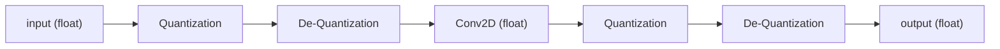
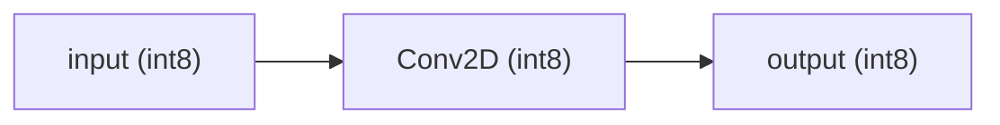
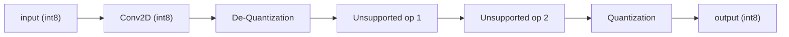

# About Quantization

This guide is under construction

Sources:

- [Pytorch Quantization docs](https://pytorch.org/docs/stable/quantization.html)
- [Pytorch blog: quantization in practice](https://pytorch.org/blog/quantization-in-practice/)
- [ONNX Quantization docs](https://onnxruntime.ai/docs/performance/model-optimizations/quantization.html)
- [Tensorflow Quantization docs](https://ai.google.dev/edge/litert/models/model_optimization?hl=en)
- [Huggingface Quantization docs](https://huggingface.co/docs/transformers/main/en/main_classes/quantization)

TODO:
- [ ] Add style guide for location comments

## Definition

In computation, quantization is the method to convert calculations from a higher precision but memory and processing heavy format to a lower memory and processing format in exchange of the precision that the higher format has. In most cases when talking about quantization of AI models, machine learning and neural networks, the process refers to converting a model's weights and computations from floating point numbers in 32 bit memory, to the 4 times compressed 8 bit format. This is done not only to save memory of the model itself, but to make it possible to calculate the results faster in lesser equipped hardware. For example, while the model might be trained for hours or days on a GPU with faster processing, the final model might be more usable in smaller or mobile CPU devices if it is quantized in this way. This presents many difficulties and technical knowledge so I prepared this guide for myself and others to use when needed.

## Quantization Affine Transformations, quantization parameters, and 8-bit computations

The process of quantizing a tensor (for example, the weights or the input and output of a neural network node) is done via an [affine transformation](https://en.wikipedia.org/wiki/Affine_transformation), in this case specifically, a scaling and translation transformation. Scaling is done to reduce the range of possible 32 bit numbers (`2^32=4294967296` values) to the 8 bit range (`2^8=256` values). Scaling the whole range, however, would be not only inefficient but most of the information would be lost. There needs to be a relevant minimum and maximum value that can be mapped to the 8 bit range and calculate a scaling factor and then the translation can be given to map the value corresponding to zero to correctly handle positive and negative values during calculations. These values are often referred to as **quantization parameters**, which are often *scale* and *zero point*. There is also *minimum value*, *maximum value* for the observed floating point values to be used in the scaling, and *quantization maximum* and *quantization minimum* to refer to the range of 8 bit values to be used. 

Below I show a visual representation of this:

```python
x = tensor(dtype=float32)
quant_min = 0   # or -128 or -127
quant_max = 255 # or 127
z = zero_point

min_value-----------0-------------max_value
       ↓            ↓             ↓
       quant_min----z----quant_max

```

### Symmetric vs Asymmetric quantization parameters

Depending on the calculation being performed, or the backend specifications ([Pytorch](https://pytorch.org/docs/stable/quantization.html), [ONNXRuntime](https://onnxruntime.ai/docs/), [TFLite](https://ai.google.dev/edge/litert/models/model_optimization?hl=en), [TensorRT](https://developer.nvidia.com/tensorrt), [OpenVINO](https://github.com/openvinotoolkit/openvino), etc.) the quantization range of values and zero point mapping might be preferred to be symmetric or asymmetric. 

For symmetric quantization, the absolute values of the input are used to calculate a maximum value, and then mirrored from 0 to represent the minimum value. This is slightly less efficient in terms of mapping range, since some of the range will be unused, but it will increase calculation speed since the zero point does not need to be determined or considered in the calculations, as it will always map to 0.

Visually represented, the symmetric quantization would be like this:

```python
x = tensor(dtype=float32)
quant_min = -128 # asymmetric range or -127 for symmetric range
quant_max = 127
zero_point = 0

-max(abs(x))-----------0-------------max(abs(x))
          ↓            ↓             ↓
          quant_min----0----quant_max
```

This representation is particularly useful in weighted and biased operations, since the multiplication of quantized values introduces the need to calculate an intermediate zero point for the product before adding any other values.

### Quantization Parameter calculation

To calculate the quantization parameters, as well as the quantized tensor with asymmetric quantization, we use the following formulas:

```python
x = tensor(dtype=float32)

quant_min = 0   # or -128 or -127
quant_max = 255 # or 127

quant_x = round((x / scale) + zero_point).clamp(quant_min, quant_max)
scale = (max(x) - min(x)) / (quant_max - quant_min)

# Solving from formulas:
quant_min = round((min(x) / scale) + zero_point)
zero_point = round(quant_min - (min(x)/scale))
# or
quant_max = round((max(x) / scale) + zero_point)
zero_point = round(quant_max - (max(x)/scale))

z = zero_point

min(x)-----------0-------------max(x)
    ↓            ↓             ↓
    quant_min----z----quant_max


dequant_x = (quant_x - zero_point)*scale


            quant_min----z----quant_max
            ↓            ↓             ↓
approx_min_x-------------0-------------approx_max_x

approx_min_x ~= min(x)
approx_max_x ~= max(x)

```

You will notice that to calculate the quantized value rounding is performed, which then when converted back to a floating point number, loses some accuracy.

Because a model will have numerous layers and calculation, the loss of performance is increased with each layer that is used. To counter this loss in performance, there is usually also a need to reduce the floating point model itself, or to modify the weights to accommodate for this loss. This will be discussed in a later section.

Now, for symmetric quantization, the following formulas are used:

```python
x = tensor(dtype=float32)

quant_min = -128 # asymmetric range or -127 for symmetric range
quant_max = 127
quant_x = round((x / scale)).clamp(quant_min, quant_max)
scale = (2*(max(abs(x)))) / (quant_max - quant_min)
zero_point = 0

-max(abs(x))-----------0-------------max(abs(x))
          ↓            ↓             ↓
          quant_min----0----quant_max

dequant_x = quant_x*scale

                 quant_min----0----quant_max
                 ↓            ↓             ↓
-approx_max_abs_x-------------0-------------approx_max_abs_x

approx_max_abs_x ~= max(abs(x))
```

Notice that the calculations are made simpler as mentioned before.

Now, some backends will use the inverse of the scale formula, to multiply instead of divide by the scale parameter, so one must be careful when trying to replicate a model in a different format.

### Signed and Unsigned quantization ranges

Depending on the backend, some operations can be done on different ranges of the 8-bit representation format.

- Unsigned (asymmetric range): `[0,255]`: 256 values
- Signed asymmetric range: `[-128,127]`: 256 values, zero-point can be wherever.
- Signed symmetric range: `[-127,127]`: 255 values, zero-point is always 0, and is usually used for per-axis calculations in some backends (for example, [TFLite](https://ai.google.dev/edge/litert/models/quantization_spec))


### 16-bit quantization

Some backends will allow for a 16-bit quantization format, which will lower the calculations from the memory heavy 32-bit floating point values to 16-bit floating point values. Because they are still floating point values, less precision is lost, while taking up more calculation power than 8-bit calculations, and not all backends have this implementation, making it a less common option.

### Per-Tensor and Per-Channel / Per-Axis Quantization Schemes

Some operations (but not all) allow for a quantization of a tensor where the parameters are calculated in a more granular manner by using an axis of the tensor as if it were multiple tensors.

For example, in networks that handle 2D image inputs, there are batch, RGB channels, width and height axes. After the input, within the network, the channels don't always represent the colors; however, they are still called channels.

This per-axis or per-channel quantization results in a scaling tensor and a zero point tensor, instead of a single value for each, with a size matching the number of channels in the tensor to be quantized.

The use of per-channel quantization is usually appropriate for the weight tensors, but unless the model is very simple, it is not recommended for input and output quantization (otherwise called activation quantization).

This allows for the range of each channel to not waste space in the 8-bit range when scaling the tensor, since the minimum and maximum values can be different for each of them.

## Static vs Dynamic Quantization modes

Until now, I have discussed the quantization of models by assuming that both the input and output (activation) tensors, as well as weight tensors are quantized. This is called **static** quantization.

While the weight tensors are available in a trained model, the input and output tensors are different with each inference, which makes it so that the parameters can't be calculated directly from the model. To be able to calculate the quantization of input and output parameters, some sort of approximation to the most efficient but still wide enough range of minimums and maximums in the data. This is often done by sending representative data, which is called **calibration**. This is doable for all types of operation layers, but if the data is not representative enough, the model might not perform correctly when new data is introduced. 

However, one can leave the input and output quantization parameters without calculation, and calculate them on the run when using the model. This offers more flexibility with the input, but it introduces more calculations to be done and increases the latency of the model, as well as not being available for all operations, and depending heavily on the backend.

### Choosing a quantization mode

According to the [onnx documentation](https://onnxruntime.ai/docs/performance/model-optimizations/quantization.html#method-selection), it is better to use static quantization for convolutional models, while dynamic quantization is better for transformer based and recursive neural network models. This is, however, not a rule that will fit every case, and in case of desiring faster performance over precision, static quantization is always preferred.

It is also important to note that dynamic quantization applies to Post Training Quantization but not to Quantization Aware Training. The difference between these is explained in a later section.

### Static vs. Dynamic Quantization support

The available operators for static or dynamic quantization differs by each backend. The most used are listed below:

- Pytorch
    - [Pytorch mode recommendation matrix](https://pytorch.org/docs/stable/quantization.html#quantization-mode-support)
        - Dynamic quantization is recommended for LSTM, MLP, Embedding, and Transformer models using Post Training Quantization, but not for Quantization Aware Training.
    - [Pytorch operator support matrix](https://pytorch.org/docs/stable/quantization.html#operator-support)
        - Convolutions don't support dynamic quantization in pytorch.
        - RNN, GRU, LSTM don't support static quantization in pytorch.
        - Multihead Attention is not supported in either quantization mode in pytorch.
- [ONNX quantization method selection](https://onnxruntime.ai/docs/performance/model-optimizations/quantization.html#method-selection)
    - There are suggestions but not a list of supported operators
- [Tensorflow dynamic range quantization docs](https://ai.google.dev/edge/litert/models/post_training_quant?hl=en)


## Post-Training Quantization (PTQ) vs. Quantization Aware Training (QAT)

A model can be quantized during or after being trained fully. Moreover, quantization during training is a more recent development, so most quantization documentation in the past is about quantizing the model after training.

**Post-Training Quantization**, or **PTQ** is used when quantizing the model after training fully, usually referring to *static* or *dynamic* quantization, and in the case of static quantization, uses *calibration* representative data to calculate the quantization parameters. The weights of the model are in this case, unaffected by the quantization process except for the scaling and translation that occurs.

**Quantization Aware Training** or **QAT** is a bit different in that it introduces an object that stores the quantization parameters in between operators, then trains the model while actively registering the new minimums and maximums, calculating the new quantization parameters, and optimizing the weights during back propagation to reduce the loss of the model. Like I mentioned before, the rounding that happens in quantization propagates some reduction in performance, but this can be countered by the adjusting of the weights to a place where the quantization and rounding has less of an effect.

An even more recent development is **Learnable Step-size Quantization** or **LSQ**, where these quantization parameters are not calculated using a minimum or a maximum for each input, output, or weight tensor but instead are part of the learnable parameters adjusted during loss optimization and back propagation. This, however, is not yet widely implemented.

### How recent is QAT and LSQ

For quantization aware training, the earliest I could find in an academic context is [a paper by Jacob et al. in 2017](https://arxiv.org/pdf/1712.05877).
Pytorch has had implementations of quantization since 1.4.0 in 2020, which included QAT (although it has improved greatly since), while Tensorflow implemented a full API for QAT with `tensorflow-model-optimization` 0.3.0 in 2020 as well. This makes the API implementation quite recent, although guides have been more available in the last few years. 

[Learned Step Quantization was introduced by Esser et al. in 2020](https://arxiv.org/pdf/1902.08153), with pytorch [having an undocumented private module implementing it](https://github.com/pytorch/pytorch/blob/main/torch/ao/quantization/_learnable_fake_quantize.py), presumably still under development; and Tensorflow not having this implementation yet as of 2024-09.


## QDQ representation format

While there are quantized operations defined in each backend that correspond to the actual quantized tensors being used for calculation, it is difficult to match all of them when converting from format to format, as well as impractical for developers to know which quantized operations correspond to which float counterparts. It is also not necessary to have these until the model is fully quantized, and there is the need to have an intermediate representation when calibrating or training models that represents the quantization process but keeps the values as floating point values for using in the next operation. This representation consists of an operation, a quantization of the output and a dequantization of the output, followed by the next operation. 

This is often called a **QDQ** representation (Q: quantization, DQ: Dequantization).



Which is then interpreted by the backend and replaced with quantized versions of the nodes:



This allows for easier conversion between backends but it also allows for nodes where quantization is unsupported to be inserted in the model without much issue.

```mermaid
graph LR
    I["input (float)"] -->
    QA[Quantization] -->
    DA[De-Quantization] -->
    C["Conv2D (float)"] -->
    QB[Quantization] -->
    DB[De-Quantization] -->
    U1[Unsupported op 1] -->
    U2[Unsupported op 2] -->
    QC[Quantization] -->
    DC[De-Quantization] -->
    O["output (float)"]
```





## Quantization Code implementation

### Examples environment

Example code was run on a docker container with CUDA 12.1 CUDNN 8 poetry and python 3.11.10:


```Dockerfile
# @ ./env_build/dockerfiles/poetry_python_-_3-11_cuda12-1_cv-builds.dockerfile

FROM nvidia/cuda:12.1.0-cudnn8-devel-ubuntu22.04

ENV CUDA_INT=121
ENV CUDA_TOOLKIT_ROOT_DIR=/usr/local/cuda-12.1
ENV CUDNN_DIR=/opt/cudnn
ENV CUDACXX=/usr/local/cuda/bin/nvcc-12.1

ENV LD_LIBRARY_PATH=/usr/local/lib64
ENV LD_LIBRARY_PATH=$CUDA_TOOLKIT_ROOT_DIR/lib64:$CUDNN_DIR/lib64:$LD_LIBRARY_PATH

ENV HOME="/root"
WORKDIR /root/workspace

ENV DEBIAN_FRONTEND=noninteractive
ENV FORCE_CUDA="1"

# cannot remove LANG even though https://bugs.python.org/issue19846 is fixed
# last attempted removal of LANG broke many users:
# https://github.com/docker-library/python/pull/570
ENV LANG=C.UTF-8

# avoid tzdata from interrupting build to ask location
RUN apt-get update; \
    DEBIAN_FRONTEND=noninteractive apt-get install -y tzdata; \
    apt-get clean

# runtime dependencies
# pyenv see https://github.com/pyenv/pyenv/wiki#troubleshooting--faq
# plus common utilities
RUN apt-get update && apt-get install -y --no-install-recommends \
        apt-utils \
        build-essential \
        ca-certificates \
        curl \
        git \
        libbluetooth-dev \
        libbz2-dev \
        libffi-dev \
        liblzma-dev \
        libncurses5-dev \
        libncursesw5-dev \
        libreadline-dev \
        libsqlite3-dev \
        libssl-dev \
        libxml2-dev \
        libxmlsec1-dev \
        llvm \
        make \
        nano \
        tk-dev \
        unzip \
        uuid-dev \
        vim \
        wget \
        xz-utils \
        zlib1g-dev \
        # usability dependencies for audio and computer vision AI
        ffmpeg \
        g++-12 \
        gcc-12 \
        libgl1 \
        libgomp1 \
        libopencv-dev \
        libprotobuf-dev protobuf-compiler \
        libsm6 \
        libxext6 \
    && rm -rf /var/lib/apt/lists/*

# install pyenv and python 3.11.10
# as of 2024-09, pytorch supports 3.12 but tensorflow seems to have some issues
# https://github.com/tensorflow/tensorflow/issues/62003
RUN git clone --depth=1 https://github.com/pyenv/pyenv.git ~/.pyenv
ENV PYENV_ROOT="${HOME}/.pyenv"
ENV PATH="${PYENV_ROOT}/shims:${PYENV_ROOT}/bin:${PATH}"

RUN pyenv install 3.11.10
RUN pyenv global 3.11.10
RUN pyenv rehash

# Install poetry with pipx
RUN pip install pipx
ENV PATH="$PATH:/root/.local/bin"
RUN pipx install poetry && \
    pipx inject poetry poetry-plugin-export && \
    pipx install toml-cli

# Install cmake
# requires libprotobuf-dev protobuf-compiler
RUN wget https://github.com/Kitware/CMake/releases/download/v3.30.4/cmake-3.30.4-linux-x86_64.tar.gz && \
    tar -zxvf cmake-3.30.4-linux-x86_64.tar.gz && \
    rm cmake-3.30.4-linux-x86_64.tar.gz && \
    mv cmake-* cmake

ENV PATH=/root/cmake/bin:$PATH

CMD ["/bin/bash"]

```

Then build and run the container:


```sh
# @ shell(linux/mac_osx/wsl)

docker pull nvidia/cuda:12.1.0-cudnn8-devel-ubuntu22.04
docker build --file ./env_build/dockerfiles/poetry_python_-_3-11_cuda12-1_cv-builds.dockerfile --tag poetry_python:3.11_cuda12.1_cudnn8_cv-builds .
docker run \
    --interactive \
    --tty \
    --detach \
    --ipc=host \
    --shm-size=4gb \
    --gpus all \
    --volume ${PWD%/*}:/v \
    --name ai_dev_example \
    poetry_python:3.11_cuda12.1_cudnn8_cv-builds \
    bash
docker exec -it -w /v/ai_python_dev_reference/ai_dev_examples_cuda_12 ai_dev_example bash
```

```sh
# @ ai_dev_example::/v/ai_python_dev_reference
mkdir ai_examples_cuda_12
cd ai_examples_cuda_12
poetry init \
    --name "ai_examples" \
    --description "AI model example code for training and quantization, as well as converting, pytorch, onnx, tflite, and ai_edge_torch" \
    --python "~3.11" \
    --author "Elisa Aleman <elisa.claire.aleman.carreon@gmail.com>" \
    --license "GPL-3.0-or-later" \
    --no-interaction
mkdir ai_examples
touch ai_examples/__init__.py
touch README.md

poetry add torch==2.4.0 torchvision@* tensorflow-cpu@* onnx@* onnxruntime@* ai_edge_torch
poetry install
poetry shell

# @ ai_dev_example::poetry_shell::/v/ai_python_dev_reference/ai_examples_cuda_12
python
```

But it can also be run in a Google Colab notebook with the environment, with the caveat that it will run a specific python version (at the time of writing `3.10.12`), and has no dependency solver.

```python
!pip install torch==2.4.0 torchvision==0.19.0 tensorflow-cpu==2.17.0 onnx==1.16.2 onnxruntime==1.19.2 ai_edge_torch==0.2.0
```

### Pytorch Quantization

Sources:

- [Pytorch Quantization docs](https://pytorch.org/docs/stable/quantization.html)

#### Model Quantization by Model Modes


Throughout the development of quantization API in pytorch there has been 3 major methods depending on the mode the model is in:

- **Eager Mode quantization**: The Eager Mode model (a model left as written in the class definition) is executed directly, along with quantization stubs if present.
    - This method relies on refactoring the model in such a way that the added quantization and dequantization operations are manually written inside the model.
    - This method requires a high-level knowledge of the compatibility of each operation with quantization, and it is prone to errors and missed optimizations.
- **FX Graph Mode quantization**: An FX Graph is a trace of the operations of the model ahead of time (AoT). When quantizing an FX model, quantization nodes are simply added automatically to the model.
    - This method relies on the model being traceable in a consistent way with proxy (not real) tensors. `for` loops, `if` conditions, and other operations that rely on the proxy tensor being a real tensor cannot be traced, so the model needs to be refactored.
    - Quantization is not the only thing that can be added programmatically to the model, and modules can easily be replaced if necessary.
    - Finally, the model is translated to TorchScript code, so code that is traceable with FX graphs but not compatible with TorchScript translation also needs to be refactored.
    - Tracing can be done at operation or module level, and the modules stay within the model.
- **Pytorch 2 Export (PT2E) mode quantization**: Pytorch 2 Export (PT2E) introduced a new way of tracing the model in its lowest pytorch operators using Torch Dynamo instead.
    - More thorough than FX graph mode tracing, but still won't allow certain code that is untraceable. Most models don't need any refactoring when using this mode.
    - Since it is traced at an operation instead of a module level, the model is entirely flattened, so post-tracing modification is more granular, and therefore, more advanced.
    - Since it is traced at an operation instead of a module level, it is more easily converted to other backends.
    
Each of them has its benefits (although eager mode is the least versatile and hardest to do correctly), and the way to implement them all is different. In all cases, some refactoring of the model might be needed, depending on compatibility issues.

The modes described above aren't necessarily for quantization only; instead, they are modes of representation of a model with different capabilities each, so they will be described below.

Another note is that the FX Graph mode, although very useful, has been declared as "maintenance only", which means no further development will be added. This means that some of the newer backend configurations or updates are not included at all. However, some third party models can only be trained in FX Graph mode and not in PT2E mode, so there is still use for this mode. On the other hand, a fully trained FX Graph model can then be converted to a PT2E model with some ingenuity.

##### Eager Mode models

Eager mode models are, in most cases, only referred to as eager mode when handling quantization, but in fact they are the default way that a model behaves when defined following the standard pytorch structures. A module is defined, and submodules can be added to it, followed by a `forward()` method that describes the call behavior of the model.

A simple example is shown below:

```python
import torch

class ExampleModel(torch.nn.Module):
    '''
    Expects mnist input of shape (batch,3,28,28)
    '''
    def __init__(self):
        super().__init__()
        self.conv = torch.nn.Conv2d(3,10,1,1)
        self.pool = torch.nn.AdaptiveMaxPool2d((1,1))
        # self.pool = torch.nn.MaxPool2d(28,28)
    def forward(self,x):
        x = self.conv(x)
        x = self.pool(x)
        x = torch.argmax(x,dim=1)
        return x

my_model = ExampleModel()
```

\**Note: The example models in this guide are extremely simple and will not have good results, but are used just for showing a functioning program.*

To quantize a model in this mode without altering its inherent structure is impossible, since the definitions strictly only include floating point operations. It is because of this that a considerable amount of refactoring is necessary.

The forward call of the model is not recorded previous to its execution as part of the model's memory, instead, it is executed in order every time that a call is made. This might seem unnecessary to describe as it should be common knowledge, but the other modes behave differently from this.

##### FX Graph Mode

Source:
- [Pytorch API docs: torch.fx](https://pytorch.org/docs/stable/fx.html)

An FX Graph is a trace of the calling (with arguments) of submodules, functions, methods and attributes of the model ahead of time. 
It is a flattened representation of the model, with exception of leaf nodes, where the relationship between calls is stored in a graph.


```python
import torch
from torch.ao.quantization.fx.tracer import QuantizationTracer
from torch.fx import GraphModule

class ExampleModel(torch.nn.Module):
    '''
    Expects mnist input of shape (batch,3,28,28)
    '''
    def __init__(self):
        super().__init__()
        self.conv = torch.nn.Conv2d(3,10,1,1)
        self.pool = torch.nn.AdaptiveMaxPool2d((1,1))
        # self.pool = torch.nn.MaxPool2d(28,28)
    def forward(self,x):
        x = self.conv(x)
        x = self.pool(x)
        x = torch.argmax(x,dim=1)
        return x

model = ExampleModel()
print(model)
'''
ExampleModel(
  (conv): Conv2d(3, 10, kernel_size=(1, 1), stride=(1, 1))
  (pool): AdaptiveMaxPool2d(output_size=(1, 1))
)
'''

# FX trace the model
tracer = QuantizationTracer(skipped_module_names=[], skipped_module_classes=[])
graph = tracer.trace(model)
traced_fx = GraphModule(tracer.root, graph, 'ExampleModel')
print(traced_fx)
'''
ExampleModel(
  (conv): Conv2d(3, 10, kernel_size=(1, 1), stride=(1, 1))
  (pool): AdaptiveMaxPool2d(output_size=(1, 1))
)


def forward(self, x):
    conv = self.conv(x);  x = None
    pool = self.pool(conv);  conv = None
    argmax = torch.argmax(pool, dim = 1);  pool = None
    return argmax
    
# To see more debug info, please use `graph_module.print_readable()`
'''

print(str(traced_fx.graph))
'''
graph():
    %x : [num_users=1] = placeholder[target=x]
    %conv : [num_users=1] = call_module[target=conv](args = (%x,), kwargs = {})
    %pool : [num_users=1] = call_module[target=pool](args = (%conv,), kwargs = {})
    %argmax : [num_users=1] = call_function[target=torch.argmax](args = (%pool,), kwargs = {dim: 1})
    return argmax
'''
```

The model now has this flattened information which can be accessed, parsed, and modified using the API described in the [Pytorch API docs: torch.fx](https://pytorch.org/docs/stable/fx.html)

A `GraphModule` contains the relevant submodules that still need to be called from the `Graph`, which is composed of `Node` objects, which have information about what each operation will be carried, and where the input is coming from.

A disadvantage of FX Graph mode is that the model has to be able to be flattened, with a single graph being able to handle all types of input of the model. This means that in-place modifications, boolean flag flow control and other operations aren't compatible with this mode. 

This means that sometimes, refactoring is necessary for the model. However, compared to the refactoring done for Eager mode models quantization, it is less knowledge intensive of the specific backend specifications, which can be automatically added.

##### Pytorch 2 Export (PT2E) Mode

Sources:
- [Pytorch API docs: torch.export](https://pytorch.org/docs/stable/export.html)
- [Pytorch torch.export Tutorial](https://pytorch.org/tutorials/intermediate/torch_export_tutorial.html)
- [Pytorch API docs: TorchDynamo APIs for fine-grained tracing](https://pytorch.org/docs/stable/torch.compiler_fine_grain_apis.html)
- [Pytorch API docs: torch.export IRs: Core Aten IR](https://pytorch.org/docs/stable/torch.compiler_ir.html#core-aten-ir)

With the introduction of torch version 2, the [`torch.export`](https://pytorch.org/docs/stable/export.html),  functionality was added.

With either an initial Eager mode or FX Graph mode model, the PT2E process uses TorchDynamo to trace the model in its most granular form, while still restricting the trace to maintain single-graph representation to be able to export the model to other backends. While TorchDynamo allows for multi-graph representation to avoid issues when tracing through flow control, for loops, if conditions, etc, the `torch.export` process also needs to avoid those to work correctly. Therefore, most (but not all) changes to the model for it to be exportable need to be made similarly to FX Graph mode. The difference however, is that FX Graph mode allows for skipping the tracing of certain nodes, while torch.export must be fully granular.

The result is a model that has only calls to the C++ API operators in `torch.ops.aten`, listed in the [Core Aten intermediate representation table](https://pytorch.org/docs/stable/torch.compiler_ir.html#core-aten-ir). These "ops" (operators) are the building blocks of torch models, and were originally only used internally, but are now useful in the exported graph to find equivalent operators in other backends, such as [OpenXLA](https://github.com/openxla/xla), for example, on [torch-xla](https://github.com/pytorch/xla).

Here's an example:

```python
import torch

class ExampleModel(torch.nn.Module):
    '''
    Expects mnist input of shape (batch,3,28,28)
    '''
    def __init__(self):
        super().__init__()
        self.conv = torch.nn.Conv2d(3,10,1,1)
        self.pool = torch.nn.AdaptiveMaxPool2d((1,1))
        # self.pool = torch.nn.MaxPool2d(28,28)
    def forward(self,x):
        x = self.conv(x)
        x = self.pool(x)
        x = torch.argmax(x,dim=1)
        return x

model = ExampleModel()
print(model)
'''
ExampleModel(
  (conv): Conv2d(3, 10, kernel_size=(1, 1), stride=(1, 1))
  (pool): AdaptiveMaxPool2d(output_size=(1, 1))
)
'''

example_inputs = (torch.randn(1,3,28,28),)

pt2e_traced_model = torch.export.export(
    model,
    example_inputs,
    ).module()


print(pt2e_traced_model)
'''
GraphModule(
  (conv): Module()
)


def forward(self, x):
    x, = fx_pytree.tree_flatten_spec(([x], {}), self._in_spec)
    conv_weight = self.conv.weight
    conv_bias = self.conv.bias
    conv2d = torch.ops.aten.conv2d.default(x, conv_weight, conv_bias);  x = conv_weight = conv_bias = None
    adaptive_max_pool2d = torch.ops.aten.adaptive_max_pool2d.default(conv2d, [1, 1]);  conv2d = None
    getitem = adaptive_max_pool2d[0];  adaptive_max_pool2d = None
    argmax = torch.ops.aten.argmax.default(getitem, 1);  getitem = None
    return pytree.tree_unflatten((argmax,), self._out_spec)

# To see more debug info, please use `graph_module.print_readable()`
'''
```

#### Quantization Configuration

Pytorch handles the calculation of quantization parameters, as well as the different types of quantization, and the compatibility of quantizeable and non-quantizeable operations with a *Quantization Configuration*, as well as a *Backend Configuration* for earlier methods or a unified *Quantizer* for the PT2E methods. It can determine if the quantization is to 8-bits, what the range of values will be, if it will be symmetric or asymmetric, per-tensor or per-channel, static or dynamic, etc.

The configuration is responsible for determining where to input a *fake quantization* and *observer* modules in the earlier methods, or a quantization and dequantization operation in the PT2E methods.

While the introduced objects are different, it is basically performing a similar task, which I will explain in the following section.

##### FakeQuantize and Observer classes

The [`torch.ao.quantization.fake_quantize.FakeQuantize`](https://pytorch.org/docs/stable/generated/torch.ao.quantization.fake_quantize.FakeQuantize.html) class is a module that encapsulates a quantize and dequantize operation for a given input, following a previous operation or input. It is basically keeping the values as floating point values while introducing the loss in performance that would occur were the model already quantized. Therefore, it is a fake quantization, and not a real one. This is also explained above in the [QDQ representation section](#qdq-representation-format). Inside it there is a [`torch.ao.quantization.observer`](https://pytorch.org/docs/stable/quantization-support.html#torch-ao-quantization-observer) module, which keeps record of the relevant values to generate the quantization parameters.

In the case of Eager mode quantization, these classes are added within the marked quantizeable areas for each module depending on the backend configuration. In the case of FX Graph Mode quantization, these classes are added for all traced nodes depending on the backend configuration. In the case of PT2E mode quantization, it depends on annotation methods registered to the Quantizer.

The type of observer also determines the kind of calculation for quantization parameters that will be made.

Currently the following are available:

Observer class                                                                                                                                                                                                                    | Description                                                                                                                                          |
----------------------------------------------------------------------------------------------------------------------------------------------------------------------------------------------------------------------------------|------------------------------------------------------------------------------------------------------------------------------------------------------|
[ObserverBase](https://pytorch.org/docs/stable/generated/torch.ao.quantization.observer.ObserverBase.html#torch.ao.quantization.observer.ObserverBase)                                                                            | Base observer Module.                                                                                                                                |
[MinMaxObserver](https://pytorch.org/docs/stable/generated/torch.ao.quantization.observer.MinMaxObserver.html#torch.ao.quantization.observer.MinMaxObserver)                                                                      | Observer module for computing the quantization parameters based on the running min and max values.                                                   |
[MovingAverageMinMaxObserver](https://pytorch.org/docs/stable/generated/torch.ao.quantization.observer.MovingAverageMinMaxObserver.html#torch.ao.quantization.observer.MovingAverageMinMaxObserver)                               | Observer module for computing the quantization parameters based on the moving average of the min and max values.                                     |
[PerChannelMinMaxObserver](https://pytorch.org/docs/stable/generated/torch.ao.quantization.observer.PerChannelMinMaxObserver.html#torch.ao.quantization.observer.PerChannelMinMaxObserver)                                        | Observer module for computing the quantization parameters based on the running per channel min and max values.                                       |
[MovingAveragePerChannelMinMaxObserver](https://pytorch.org/docs/stable/generated/torch.ao.quantization.observer.MovingAveragePerChannelMinMaxObserver.html#torch.ao.quantization.observer.MovingAveragePerChannelMinMaxObserver) | Observer module for computing the quantization parameters based on the running per channel min and max values.                                       |
[HistogramObserver](https://pytorch.org/docs/stable/generated/torch.ao.quantization.observer.HistogramObserver.html#torch.ao.quantization.observer.HistogramObserver)                                                             | The module records the running histogram of tensor values along with min/max values.                                                                 |
[PlaceholderObserver](https://pytorch.org/docs/stable/generated/torch.ao.quantization.observer.PlaceholderObserver.html#torch.ao.quantization.observer.PlaceholderObserver)                                                       | Observer that doesn't do anything and just passes its configuration to the quantized module's .from_float(). It is used in dynamic quantization.     |
[RecordingObserver](https://pytorch.org/docs/stable/generated/torch.ao.quantization.observer.RecordingObserver.html#torch.ao.quantization.observer.RecordingObserver)                                                             | The module is mainly for debug and records the tensor values during runtime.                                                                         |
[NoopObserver](https://pytorch.org/docs/stable/generated/torch.ao.quantization.observer.NoopObserver.html#torch.ao.quantization.observer.NoopObserver)                                                                            | Observer that doesn't do anything and just passes its configuration to the quantized module's .from_float().                                         |
[FixedQParamsObserver](https://github.com/pytorch/pytorch/blob/1266be21f45e91eac32e37f9a7258a14270eab15/torch/ao/quantization/observer.py#L1384)                                                                                  | An undocumented observer used in operations where there is no need for variable quantization parameters.                                             |


There is also more than just one [fake_quantize]() class:

Fake Quantize class                                                                                                                                                                                                 | Description                                                                                                                                       |
--------------------------------------------------------------------------------------------------------------------------------------------------------------------------------------------------------------------|---------------------------------------------------------------------------------------------------------------------------------------------------|
[FakeQuantizeBase](https://pytorch.org/docs/stable/generated/torch.ao.quantization.fake_quantize.FakeQuantizeBase.html#torch.ao.quantization.fake_quantize.FakeQuantizeBase)                                        | Base fake quantize module.                                                                                                                        |
[FakeQuantize](https://pytorch.org/docs/stable/generated/torch.ao.quantization.fake_quantize.FakeQuantize.html#torch.ao.quantization.fake_quantize.FakeQuantize)                                                    | Simulate the quantize and dequantize operations in training time.                                                                                 |
[FixedQParamsFakeQuantize](https://pytorch.org/docs/stable/generated/torch.ao.quantization.fake_quantize.FixedQParamsFakeQuantize.html#torch.ao.quantization.fake_quantize.FixedQParamsFakeQuantize)                | Simulate quantize and dequantize in training time. It is fixed for a specific value range for operations without variable output range.           |
[FusedMovingAvgObsFakeQuantize](https://pytorch.org/docs/stable/generated/torch.ao.quantization.fake_quantize.FusedMovingAvgObsFakeQuantize.html#torch.ao.quantization.fake_quantize.FusedMovingAvgObsFakeQuantize) | A fused module to observe the tensor. It is used in PT2E quantization.                                                                            |
[_LearnableFakeQuantize](https://github.com/pytorch/pytorch/blob/main/torch/ao/quantization/_learnable_fake_quantize.py)                                                                                            | An undocumented private class that implements LSQ. It is presumably under development on the latest version at the time of writing (torch v2.5.0) |


##### About fused modules

Sources:

- [Pytorch Quantization docs](https://pytorch.org/docs/stable/quantization.html)
- [Pytorch Eager Mode PTQ Static Quantization Tutorial](https://pytorch.org/tutorials/advanced/static_quantization_tutorial.html)

During the insertion of quantize and dequantize modules in between operations in a model, some groupings of modules benefit from not undergoing quantization until all of the calculations have been finished. Moreover, some modules benefit from entirely forgoing their original structure that can be used in training and evaluation and being replaced with an operation that is optimized for evaluation only. The modules that benefit from this **fusing** of operations vary from backend to backend, but are usually the following:

- Convolution + Batch Normalization + ReLU activation
- Convolution + ReLU activation
- Linear + Batch Normalization + ReLU activation
- Linear + ReLU activation
- Operation + Clamp / Clip range

And so on, the usual fusing involves normalization operations which are more relevant during training, and ReLU activations or clamp or clip operations which are simply a restriction of the range of floating values. This restriction, being equivalent to the restriction imposed by the mapping to quantized values, will simply result in a different mapping that could be assumed from the start, making a double quantization unnecessary. The fusing of these nodes can be studied in [`torch.ao.nn.intrinsic`](https://pytorch.org/docs/stable/quantization-support.html#module-torch.ao.nn.intrinsic) and [`torch.ao.nn.intrinsic.qat`](https://pytorch.org/docs/stable/quantization-support.html#module-torch.ao.nn.intrinsic.qat) for pre-defined classes, and in different examples found in [`torch.ao.quantization.backend_config`](https://github.com/pytorch/pytorch/tree/main/torch/ao/quantization/backend_config) for other backend specific fusings.

Each mode has its own method of fusing. While FX and PT2E modes fusing patterns can be configured without refactoring a model and will be explained in the following sections, Eager mode quantization requires a manual change to the model in order to implement this correctly. This is shown in [Eager Mode fused modules](#eager-mode-fused-modules).

##### Eager Mode Quantization Configuration: QConfig and manual fused modules

Sources:

- [Pytorch Quantization docs](https://pytorch.org/docs/stable/quantization.html)
- [Pytorch Eager Mode PTQ Static Quantization Tutorial](https://pytorch.org/tutorials/advanced/static_quantization_tutorial.html)
- [Pytorch Eager Mode PTQ Dynamic Quantization example LSTM](https://pytorch.org/tutorials/advanced/dynamic_quantization_tutorial.html?highlight=lstm)
- [Pytorch API docs: QConfig](https://pytorch.org/docs/stable/generated/torch.ao.quantization.qconfig.QConfig.html)]

[QConfig](https://pytorch.org/docs/stable/generated/torch.ao.quantization.qconfig.QConfig.html) was the first class in pytorch to be implemented for configuring Eager Mode modules.

It is applied to a module directly by adding it to the `torch.nn.Module.qconfig` attribute. Applying it globally to the entire model is often done in Eager mode quantization when the quantization and dequantization submodules are set correctly.

Example:

```python
import torch
from torch.ao.quantization.qconfig import QConfig
from torch.ao.quantization.observer import MovingAverageMinMaxObserver, MovingAveragePerChannelMinMaxObserver

class ExampleModel(torch.nn.Module):
    '''
    Expects mnist input of shape (batch,3,28,28)
    '''
    def __init__(self):
        super().__init__()
        self.quant = torch.ao.quantization.QuantStub()
        self.dequant = torch.ao.quantization.DeQuantStub()
        self.conv = torch.nn.Conv2d(3,10,1,1)
        self.pool = torch.nn.AdaptiveMaxPool2d((1,1))
        # self.pool = torch.nn.MaxPool2d(28,28)
    def forward(self,x):
        x = self.quant(x)
        x = self.conv(x)
        x = self.pool(x)
        x = torch.argmax(x,dim=1)
        x = self.dequant(x)
        return x

my_model = ExampleModel()

my_model.qconfig = QConfig(
    activation=MovingAverageMinMaxObserver.with_args(
        dtype=torch.quint8,
        qscheme=torch.per_tensor_affine,
        ),
    weight=MovingAveragePerChannelMinMaxObserver.with_args(
        dtype=torch.qint8,
        qscheme=torch.per_channel_symmetric,
        ),
    )
print(my_model)
'''
ExampleModel(
  (quant): QuantStub()
  (dequant): DeQuantStub()
  (conv): Conv2d(3, 10, kernel_size=(1, 1), stride=(1, 1))
  (pool): AdaptiveMaxPool2d(output_size=(1, 1))
)
'''

torch.ao.quantization.prepare(my_model, inplace=True)
print(my_model)
'''
ExampleModel(
  (quant): QuantStub(
    (activation_post_process): MovingAverageMinMaxObserver(min_val=inf, max_val=-inf)
  )
  (dequant): DeQuantStub()
  (conv): Conv2d(
    3, 10, kernel_size=(1, 1), stride=(1, 1)
    (activation_post_process): MovingAverageMinMaxObserver(min_val=inf, max_val=-inf)
  )
  (pool): AdaptiveMaxPool2d(output_size=(1, 1))
)
'''
```

The model is then configured and ready for the FakeQuantize and Observer insertion during the quantization process described later.

Note that the [tutorials](https://pytorch.org/tutorials/advanced/static_quantization_tutorial.html) will use a default QConfig:

```python
import torch

print(torch.ao.quantization.get_default_qconfig('x86'))
'''
QConfig(
    activation=functools.partial(<class 'torch.ao.quantization.observer.HistogramObserver'>,
        reduce_range=True
        ){},
    weight=functools.partial(<class 'torch.ao.quantization.observer.PerChannelMinMaxObserver'>,
        dtype=torch.qint8,
        qscheme=torch.per_channel_symmetric
        ){}
    )
'''
```

This works fine in pytorch but when considering other backends to convert the model to, is not necessarily what we want, not to mention we might prefer other observers even in a native environment.

###### Eager Mode fused modules

Eager mode model before adding fused modules functionality:
```python
import torch

class ExampleModel(torch.nn.Module):
    '''
    Expects mnist input of shape (batch,3,28,28)
    '''
    def __init__(self):
        super().__init__()
        self.quant = torch.ao.quantization.QuantStub()
        self.dequant = torch.ao.quantization.DeQuantStub()
        self.conv = torch.nn.Conv2d(3,10,1,1)
        self.bn = torch.nn.BatchNorm2d(10)
        self.act = torch.nn.ReLU()
        self.pool = torch.nn.AdaptiveMaxPool2d((1,1))
        # self.pool = torch.nn.MaxPool2d(28,28)
    def forward(self,x):
        x = self.quant(x)
        x = self.conv(x)
        x = self.bn(x)
        x = self.act(x)
        x = self.pool(x)
        x = torch.argmax(x,dim=1)
        x = self.dequant(x)
        return x
```

Eager mode model after adding fused modules for PTQ:

```python
import torch

# PTQ
class ExampleModel(torch.nn.Module):
    '''
    Expects mnist input of shape (batch,3,28,28)
    '''
    def __init__(self):
        super().__init__()
        self.quant = torch.ao.quantization.QuantStub()
        self.dequant = torch.ao.quantization.DeQuantStub()
        self.conv = torch.ao.intrincic.ConvBNReLU2d(
            conv=torch.nn.Conv2d(3,10,1,1),
            bn=torch.nn.BatchNorm2d(10),
            relu=torch.nn.ReLU(),
            )
        self.pool = torch.nn.AdaptiveMaxPool2d((1,1))
        # self.pool = torch.nn.MaxPool2d(28,28)
    def forward(self,x):
        x = self.quant(x)
        x = self.conv(x)
        x = self.pool(x)
        x = torch.argmax(x,dim=1)
        x = self.dequant(x)
        return x
    def fuse_modules(self):
        for m in self.modules():
            if isinstance(m,torch.ao.intrincic.ConvBNReLU2d):
                torch.ao.quantization.fuse_modules(
                    m,
                    ['0','1','2'],
                    inplace=True,
                    )
```

Eager mode model after adding fused modules for QAT:
```python
import torch

# QAT
class ExampleModel(torch.nn.Module):
    '''
    Expects mnist input of shape (batch,3,28,28)
    '''
    def __init__(self):
        super().__init__()
        self.quant = torch.ao.quantization.QuantStub()
        self.dequant = torch.ao.quantization.DeQuantStub()
        self.conv = torch.ao.intrincic.qat.ConvBNReLU2d(
            conv=torch.nn.Conv2d(3,10,1,1),
            bn=torch.nn.BatchNorm2d(10),
            relu=torch.nn.ReLU(),
            )
        self.pool = torch.nn.AdaptiveMaxPool2d((1,1))
        # self.pool = torch.nn.MaxPool2d(28,28)
    def forward(self,x):
        x = self.quant(x)
        x = self.conv(x)
        x = self.pool(x)
        x = torch.argmax(x,dim=1)
        x = self.dequant(x)
        return x
    def fuse_modules(self):
        for m in self.modules():
            if isinstance(m,torch.ao.intrincic.ConvBNReLU2d):
                torch.ao.quantization.fuse_modules_qat(
                    m,
                    ['0','1','2'],
                    inplace=True,
                    )
```

Note that the refactoring being different introduces difficulties that aren't present in FX or PT2E modes.


##### FX Mode Quantization Configuration

###### FX Mode QConfigMapping

Sources:
- [Pytorch Quantization docs](https://pytorch.org/docs/stable/quantization.html)
- [Pytorch API docs: QConfigMapping](https://pytorch.org/docs/stable/generated/torch.ao.quantization.qconfig_mapping.QConfigMapping.html)
- [Pytorch FX Quantization user guide](https://pytorch.org/tutorials/prototype/fx_graph_mode_quant_guide.html)
- [Pytorch BackendConfig Tutorial](https://pytorch.org/tutorials/prototype/backend_config_tutorial.html)
- [Pytorch FX PTQ Static Quantization Tutorial](https://pytorch.org/tutorials/prototype/fx_graph_mode_ptq_static.html)
- [Pytorch FX PTQ Dynamic Quantization Tutorial](https://pytorch.org/tutorials/prototype/fx_graph_mode_ptq_dynamic.html)

QConfigMapping is the solution that FX mode quantization brought to the complexity of setting different configurations across the model if there were exceptions to the overall configuration for specific operations. It allows us to set a global QConfig, similar to the EagerMode example, but also provides optional API to detect different operations and add a specific configuration to those.

For the full usage guide, I recommend reading the [Pytorch API docs: QConfigMapping](https://pytorch.org/docs/stable/generated/torch.ao.quantization.qconfig_mapping.QConfigMapping.html), but below I only show an example using global configurations.

```python
import torch
from torch.ao.quantization.qconfig_mapping import QConfigMapping
from torch.ao.quantization.qconfig import QConfig
from torch.ao.quantization.observer import MovingAverageMinMaxObserver, MovingAveragePerChannelMinMaxObserver
from torch.ao.quantization.fx.tracer import QuantizationTracer
from torch.fx import GraphModule
from torch.ao.quantization.fx import prepare


class ExampleModel(torch.nn.Module):
    '''
    Expects mnist input of shape (batch,3,28,28)
    '''
    def __init__(self):
        super().__init__()
        self.conv = torch.nn.Conv2d(3,10,1,1)
        self.pool = torch.nn.AdaptiveMaxPool2d((1,1))
        # self.pool = torch.nn.MaxPool2d(28,28)
    def forward(self,x):
        x = self.conv(x)
        x = self.pool(x)
        x = torch.argmax(x,dim=1)
        return x

model = ExampleModel()

# define the qconfig_mapping
qconfig_mapping = QConfigMapping().set_global(
        QConfig(
            activation=MovingAverageMinMaxObserver.with_args(
                dtype=torch.quint8,
                qscheme=torch.per_tensor_affine,
                ),
            weight=MovingAveragePerChannelMinMaxObserver.with_args(
                dtype=torch.qint8,
                qscheme=torch.per_channel_symmetric,
                ),
            )
        )

# FX trace the model
tracer = QuantizationTracer(skipped_module_names=[], skipped_module_classes=[])
graph = tracer.trace(model)
traced_fx = GraphModule(tracer.root, graph, 'ExampleModel')
print(traced_fx)
'''
ExampleModel(
  (conv): Conv2d(3, 10, kernel_size=(1, 1), stride=(1, 1))
  (pool): AdaptiveMaxPool2d(output_size=(1, 1))
)


def forward(self, x):
    conv = self.conv(x);  x = None
    pool = self.pool(conv);  conv = None
    argmax = torch.argmax(pool, dim = 1);  pool = None
    return argmax
    
# To see more debug info, please use `graph_module.print_readable()`
'''

# FX prepare the quantization nodes
example_inputs = (torch.randn(1,3,28,28),)
prepared_fx = prepare(
    traced_fx,
    qconfig_mapping=qconfig_mapping,
    node_name_to_scope=tracer.node_name_to_scope,
    is_qat=True, # convenient even if not QAT
    example_inputs=example_inputs,
    backend_config=None, # default native
    )
print(prepared_fx)
'''
GraphModule(
  (activation_post_process_0): MovingAverageMinMaxObserver(min_val=inf, max_val=-inf)
  (conv): Conv2d(
    3, 10, kernel_size=(1, 1), stride=(1, 1)
    (weight_fake_quant): MovingAveragePerChannelMinMaxObserver(min_val=tensor([]), max_val=tensor([]))
  )
  (activation_post_process_1): MovingAverageMinMaxObserver(min_val=inf, max_val=-inf)
  (pool): AdaptiveMaxPool2d(output_size=(1, 1))
)


def forward(self, x):
    activation_post_process_0 = self.activation_post_process_0(x);  x = None
    conv = self.conv(activation_post_process_0);  activation_post_process_0 = None
    activation_post_process_1 = self.activation_post_process_1(conv);  conv = None
    pool = self.pool(activation_post_process_1);  activation_post_process_1 = None
    argmax = torch.argmax(pool, dim = 1);  pool = None
    return argmax
    
# To see more debug info, please use `graph_module.print_readable()`
'''

print(hasattr(prepared_fx, 'qconfig'))
'''
False
'''

print(hasattr(prepared_fx, 'meta'))
'''
True
'''
import pprint
pprint.pprint(prepared_fx.meta)
'''
False
True
{'_observed_graph_module_attrs': ObservedGraphModuleAttrs(node_name_to_qconfig={'argmax': QConfig(activation=functools.partial(<class 'torch.ao.quantization.observer.MovingAverageMinMaxObserver'>, dtype=torch.quint8, qscheme=torch.per_tensor_affine){}, weight=functools.partial(<class 'torch.ao.quantization.observer.MovingAveragePerChannelMinMaxObserver'>, dtype=torch.qint8, qscheme=torch.per_channel_symmetric){}),
                                                                                'conv': QConfig(activation=functools.partial(<class 'torch.ao.quantization.observer.MovingAverageMinMaxObserver'>, dtype=torch.quint8, qscheme=torch.per_tensor_affine){'factory_kwargs': <function _add_module_to_qconfig_obs_ctr.<locals>.get_factory_kwargs_based_on_module_device at 0x7ece769243a0>}, weight=functools.partial(<class 'torch.ao.quantization.observer.MovingAveragePerChannelMinMaxObserver'>, dtype=torch.qint8, qscheme=torch.per_channel_symmetric){'factory_kwargs': <function _add_module_to_qconfig_obs_ctr.<locals>.get_factory_kwargs_based_on_module_device at 0x7ece769243a0>}),
                                                                                'output': None,
                                                                                'pool': QConfig(activation=functools.partial(<class 'torch.ao.quantization.observer.MovingAverageMinMaxObserver'>, dtype=torch.quint8, qscheme=torch.per_tensor_affine){'factory_kwargs': <function _add_module_to_qconfig_obs_ctr.<locals>.get_factory_kwargs_based_on_module_device at 0x7ece76924280>}, weight=functools.partial(<class 'torch.ao.quantization.observer.MovingAveragePerChannelMinMaxObserver'>, dtype=torch.qint8, qscheme=torch.per_channel_symmetric){'factory_kwargs': <function _add_module_to_qconfig_obs_ctr.<locals>.get_factory_kwargs_based_on_module_device at 0x7ece76924280>}),
                                                                                'x': None},
                                                          node_name_to_scope={'argmax': ('',
                                                                                         None),
                                                                              'conv': ('conv',
                                                                                       <class 'torch.nn.modules.conv.Conv2d'>),
                                                                              'output': ('',
                                                                                         None),
                                                                              'pool': ('pool',
                                                                                       <class 'torch.nn.modules.pooling.AdaptiveMaxPool2d'>),
                                                                              'x': ('',
                                                                                    None)},
                                                          prepare_custom_config=PrepareCustomConfig({}),
                                                          equalization_node_name_to_qconfig={'argmax': None,
                                                                                             'conv': None,
                                                                                             'output': None,
                                                                                             'pool': None,
                                                                                             'x': None},
                                                          qconfig_mapping=QConfigMapping (
 global_qconfig
  QConfig(activation=functools.partial(<class 'torch.ao.quantization.observer.MovingAverageMinMaxObserver'>, dtype=torch.quint8, qscheme=torch.per_tensor_affine){}, weight=functools.partial(<class 'torch.ao.quantization.observer.MovingAveragePerChannelMinMaxObserver'>, dtype=torch.qint8, qscheme=torch.per_channel_symmetric){})
 object_type_qconfigs
  OrderedDict()
 module_name_regex_qconfigs
  OrderedDict()
 module_name_qconfigs
  OrderedDict()
 module_name_object_type_order_qconfigs
  OrderedDict()
),
                                                          is_qat=True,
                                                          observed_node_names={'conv'},
                                                          is_observed_standalone_module=False,
                                                          standalone_module_input_quantized_idxs=None,
                                                          standalone_module_output_quantized_idxs=None)}
'''
```

As printed above, there are new fake_quantize/observer nodes added to the forward code and to the module as submodules, but the configuration is not saved in the `qconfig` attribute but instead in a `meta` dictionary that stores the configuration for all inserted nodes.

###### FX Mode BackendConfig and BackendPatternConfig


Sources:
- [Pytorch Quantization docs](https://pytorch.org/docs/stable/quantization.html)
- [Pytorch API docs: QConfigMapping](https://pytorch.org/docs/stable/generated/torch.ao.quantization.qconfig_mapping.QConfigMapping.html)
- [Pytorch API docs: torch.fx](https://pytorch.org/docs/stable/fx.html)
- [Pytorch FX Quantization user guide](https://pytorch.org/tutorials/prototype/fx_graph_mode_quant_guide.html)
- [Pytorch BackendConfig Tutorial](https://pytorch.org/tutorials/prototype/backend_config_tutorial.html)
- [`torch.ao.quantization.backend_config` README](https://github.com/pytorch/pytorch/tree/main/torch/ao/quantization/backend_config)
- [Pytorch FX PTQ Static Quantization Tutorial](https://pytorch.org/tutorials/prototype/fx_graph_mode_ptq_static.html)
- [Pytorch FX PTQ Dynamic Quantization Tutorial](https://pytorch.org/tutorials/prototype/fx_graph_mode_ptq_dynamic.html)


Reading the [`torch.ao.quantization.backend_config` README](https://github.com/pytorch/pytorch/tree/main/torch/ao/quantization/backend_config) should give a better introduction to the configuration than what I can convey here, but I will still summarize.

Different backends will have different specifications of which modules can and cannot be quantized, what data types they allow, 8-bit value ranges, which modules should be fused or not, or which operations should share the same quantization parameters than their previous operation.

While new backends can be configured for manually by specifying a new `BackendConfig` class in each project, pytorch has several configurations already available:

```python
from torch.ao.quantization.backend_config import (
    get_fbgemm_backend_config,
    get_native_backend_config,
    get_qnnpack_backend_config,
    get_tensorrt_backend_config,
    get_executorch_backend_config,
    )
```

Namely for the following backends:

- `get_fbgemm_backend_config`: [FBGEMM](https://github.com/pytorch/FBGEMM)
- `get_native_backend_config`: Pytorch native inference
- `get_qnnpack_backend_config`: [QNNPACK](https://github.com/pytorch/QNNPACK), an outdated backend later replaced by XNNPACK
- `get_tensorrt_backend_config`: [TensorRT](https://github.com/NVIDIA/TensorRT), an NVIDIA specialized backend that makes full use of the GPU CUDA, making it faster than native inference.
- `get_executorch_backend_config`: [executorch](https://github.com/pytorch/executorch), an on-device AI backend for mobile inference of torch models.

There are also a few backend configurations available in third party packages that we can use for reference:

- [`mmrazor.structures.quantization.backend_congig.openvino`](https://github.com/open-mmlab/mmrazor/blob/main/mmrazor/structures/quantization/backend_config/openvino.py): This backend configuration was created in torch v1.13.0, before the [backwards incompatible change to BackendPatternConfig introduced in torch 2.0.0](https://github.com/pytorch/pytorch/pull/90698), which can be seen in the [torch 2.0.0 release notes](https://github.com/pytorch/pytorch/releases/tag/v2.0.0)

However, it should be easy to modify to the latest version if necessary.

###### Backend specification example: ONNXRuntime split quantization parameters

There is [onnx](https://github.com/onnx/onnx) exporting functionality in pytorch ([`torch.onnx.export`](https://pytorch.org/docs/stable/onnx.html#torchscript-based-onnx-exporter) for Eager and FX Graph modes, and [`torch.onnx.dynamo_export`](https://pytorch.org/docs/stable/onnx_dynamo.html) for dynamo and PT2E models).

This is usually done as a middle step for later conversion to another backend that is compatible with onnx but not directly with pytorch.

However, there is also the option to run these models in [ONNXRuntime](https://github.com/microsoft/onnxruntime/), which is also capable of inference with quantized models, with a variety of [execution providers](https://onnxruntime.ai/docs/execution-providers/) for the specific hardware / device that the model will be executed on.

While most of the specifications of the ONNXRuntime backend can be similar to the pytorch native backend, there are some variations.

An example not provided in the source documentation is the [ONNXRuntime quantized split node](https://github.com/microsoft/onnxruntime/blob/ee6a91533cc8034a78b183cc1d6595170a366886/onnxruntime/python/tools/quantization/operators/split.py#L63), which has specifications that the previous node and all children of the split node should have the same quantization parameters. However, the [pytorch native backend configuration](https://github.com/pytorch/pytorch/blob/main/torch/ao/quantization/backend_config/native.py), which imports from the [`_common_operator_config_utils`](https://github.com/pytorch/pytorch/blob/8225e7706ebe900593ccb6790f51e4251e7de16d/torch/ao/quantization/backend_config/_common_operator_config_utils.py#L606), can only configure shared parameters for single tensor outputs, and not for tuples. I personally add a post_processing method before exporting to ONNX if I need split nodes to be quantized correctly:

```python
import torch
from torch.ao.quantization.qconfig_mapping import QConfigMapping
from torch.ao.quantization.qconfig import QConfig
from torch.ao.quantization.observer import MovingAverageMinMaxObserver, MovingAveragePerChannelMinMaxObserver
from torch.ao.quantization.fx.tracer import QuantizationTracer
from torch.fx import GraphModule
from torch.ao.quantization.fx import prepare
from torch.ao.quantization.backend_config import ObservationType, get_native_backend_config


class ExampleModel(torch.nn.Module):
    '''
    Expects mnist input of shape (batch,3,28,28)
    '''
    def __init__(self):
        super().__init__()
        self.conv = torch.nn.Conv2d(3,30,1,1)
        self.spconv1 = torch.nn.Conv2d(15,5,1,1)
        self.spconv2 = torch.nn.Conv2d(15,5,1,1)
        self.pool = torch.nn.AdaptiveMaxPool2d((1,1))
        # self.pool = torch.nn.MaxPool2d(28,28)
    def forward(self,x):
        x = self.conv(x)
        y,z = torch.split(x,2)
        y = self.spconv1(y)
        z = self.spconv2(z)
        x = torch.cat([y,z], dim=1)
        x = self.pool(x)
        x = torch.argmax(x,dim=1)
        return x
    
model = ExampleModel()

# define the qconfig_mapping
qconfig_mapping = QConfigMapping().set_global(
        QConfig(
            activation=MovingAverageMinMaxObserver.with_args(
                dtype=torch.quint8,
                qscheme=torch.per_tensor_affine,
                ),
            weight=MovingAveragePerChannelMinMaxObserver.with_args(
                dtype=torch.qint8,
                qscheme=torch.per_channel_symmetric,
                ),
            )
        )

# FX trace the model
tracer = QuantizationTracer(skipped_module_names=[], skipped_module_classes=[])
graph = tracer.trace(model)
traced_fx = GraphModule(tracer.root, graph, 'ExampleModel')
print(traced_fx)
'''
ExampleModel(
  (conv): Conv2d(3, 30, kernel_size=(1, 1), stride=(1, 1))
  (spconv1): Conv2d(15, 5, kernel_size=(1, 1), stride=(1, 1))
  (spconv2): Conv2d(15, 5, kernel_size=(1, 1), stride=(1, 1))
  (pool): AdaptiveMaxPool2d(output_size=(1, 1))
)


def forward(self, x):
    conv = self.conv(x);  x = None
    split = torch.functional.split(conv, 2, dim = 0);  conv = None
    getitem = split[0]
    getitem_1 = split[1];  split = None
    spconv1 = self.spconv1(getitem);  getitem = None
    spconv2 = self.spconv2(getitem_1);  getitem_1 = None
    cat = torch.cat([spconv1, spconv2], dim = 1);  spconv1 = spconv2 = None
    pool = self.pool(cat);  cat = None
    argmax = torch.argmax(pool, dim = 1);  pool = None
    return argmax
    
# To see more debug info, please use `graph_module.print_readable()`
'''

# FX prepare the quantization nodes
example_inputs = (torch.randn(1,3,28,28),)
backend_config = get_native_backend_config()
prepared_fx = prepare(
    traced_fx,
    qconfig_mapping=qconfig_mapping,
    node_name_to_scope=tracer.node_name_to_scope,
    is_qat=True, # convenient even if not QAT
    example_inputs=example_inputs,
    backend_config=backend_config,
    )
print(prepared_fx)
'''
GraphModule(
  (activation_post_process_0): MovingAverageMinMaxObserver(min_val=inf, max_val=-inf)
  (conv): Conv2d(
    3, 30, kernel_size=(1, 1), stride=(1, 1)
    (weight_fake_quant): MovingAveragePerChannelMinMaxObserver(min_val=tensor([]), max_val=tensor([]))
  )
  (activation_post_process_1): MovingAverageMinMaxObserver(min_val=inf, max_val=-inf)
  (activation_post_process_2): MovingAverageMinMaxObserver(min_val=inf, max_val=-inf)
  (activation_post_process_4): MovingAverageMinMaxObserver(min_val=inf, max_val=-inf)
  (spconv1): Conv2d(
    15, 5, kernel_size=(1, 1), stride=(1, 1)
    (weight_fake_quant): MovingAveragePerChannelMinMaxObserver(min_val=tensor([]), max_val=tensor([]))
  )
  (activation_post_process_3): MovingAverageMinMaxObserver(min_val=inf, max_val=-inf)
  (spconv2): Conv2d(
    15, 5, kernel_size=(1, 1), stride=(1, 1)
    (weight_fake_quant): MovingAveragePerChannelMinMaxObserver(min_val=tensor([]), max_val=tensor([]))
  )
  (activation_post_process_5): MovingAverageMinMaxObserver(min_val=inf, max_val=-inf)
  (activation_post_process_6): MovingAverageMinMaxObserver(min_val=inf, max_val=-inf)
  (pool): AdaptiveMaxPool2d(output_size=(1, 1))
)


def forward(self, x):
    activation_post_process_0 = self.activation_post_process_0(x);  x = None
    conv = self.conv(activation_post_process_0);  activation_post_process_0 = None
    activation_post_process_1 = self.activation_post_process_1(conv);  conv = None
    split = torch.functional.split(activation_post_process_1, 2, dim = 0);  activation_post_process_1 = None
    getitem = split[0]
    activation_post_process_2 = self.activation_post_process_2(getitem);  getitem = None
    getitem_1 = split[1];  split = None
    activation_post_process_4 = self.activation_post_process_4(getitem_1);  getitem_1 = None
    spconv1 = self.spconv1(activation_post_process_2);  activation_post_process_2 = None
    activation_post_process_3 = self.activation_post_process_3(spconv1);  spconv1 = None
    spconv2 = self.spconv2(activation_post_process_4);  activation_post_process_4 = None
    activation_post_process_5 = self.activation_post_process_5(spconv2);  spconv2 = None
    cat = torch.cat([activation_post_process_3, activation_post_process_5], dim = 1);  activation_post_process_3 = activation_post_process_5 = None
    activation_post_process_6 = self.activation_post_process_6(cat);  cat = None
    pool = self.pool(activation_post_process_6);  activation_post_process_6 = None
    argmax = torch.argmax(pool, dim = 1);  pool = None
    return argmax
    
# To see more debug info, please use `graph_module.print_readable()`
'''

def propagate_split_share_qparams(
        observed_module,
        backend_config,
        ):
    share_qparams_ops = [
        pattern_cfg.pattern
        for pattern_cfg in backend_config.configs
        if pattern_cfg.observation_type == ObservationType.OUTPUT_SHARE_OBSERVER_WITH_INPUT
        ]
    # First share qparams for all split children
    for current_node in observed_module.graph.nodes:
        if current_node.target in [torch.split, torch.chunk]:
            previous_nodes = current_node.all_input_nodes
            if len(previous_nodes) == 1:
                previous_node = previous_nodes[0]
                # if the previous node before split is fake_quantize:
                if 'activation_post_process_' in previous_node.name:
                    child_nodes = [user for user in current_node.users.keys()]
                    for child_node in child_nodes:
                        child_node_users = [user for user in child_node.users.keys()]
                        if len(child_node_users)==1:
                            child_node_next = child_node_users[0]
                            # if the nodes after split are fake_quantize:
                            if 'activation_post_process_' in child_node_next.name:
                                child_node_next.target = previous_node.target
    # do another pass for all share qparams nodes in case they were acidentally altered.
    for current_node in observed_module.graph.nodes:
        if current_node.target in share_qparams_ops:
            previous_nodes = current_node.all_input_nodes
            if len(previous_nodes) == 1:
                previous_node = previous_nodes[0]
                # if the previous node before split is fake_quantize:
                if 'activation_post_process_' in previous_node.name:
                    user_nodes = [user for user in current_node.users.keys()]
                    if len(user_nodes) == 1:
                        user_node = user_nodes[0]
                        # if the nodes after the op are fake_quantize:
                        if 'activation_post_process_' in user_node.name:
                            user_node.target = previous_node.target
    observed_module.delete_all_unused_submodules()
    observed_module.recompile()


propagate_split_share_qparams(prepared_fx, backend_config)
print(prepared_fx)
'''
GraphModule(
  (activation_post_process_0): MovingAverageMinMaxObserver(min_val=inf, max_val=-inf)
  (conv): Conv2d(
    3, 30, kernel_size=(1, 1), stride=(1, 1)
    (weight_fake_quant): MovingAveragePerChannelMinMaxObserver(min_val=tensor([]), max_val=tensor([]))
  )
  (activation_post_process_1): MovingAverageMinMaxObserver(min_val=inf, max_val=-inf)
  (spconv1): Conv2d(
    15, 5, kernel_size=(1, 1), stride=(1, 1)
    (weight_fake_quant): MovingAveragePerChannelMinMaxObserver(min_val=tensor([]), max_val=tensor([]))
  )
  (activation_post_process_3): MovingAverageMinMaxObserver(min_val=inf, max_val=-inf)
  (spconv2): Conv2d(
    15, 5, kernel_size=(1, 1), stride=(1, 1)
    (weight_fake_quant): MovingAveragePerChannelMinMaxObserver(min_val=tensor([]), max_val=tensor([]))
  )
  (activation_post_process_5): MovingAverageMinMaxObserver(min_val=inf, max_val=-inf)
  (activation_post_process_6): MovingAverageMinMaxObserver(min_val=inf, max_val=-inf)
  (pool): AdaptiveMaxPool2d(output_size=(1, 1))
)


def forward(self, x):
    activation_post_process_0 = self.activation_post_process_0(x);  x = None
    conv = self.conv(activation_post_process_0);  activation_post_process_0 = None
    activation_post_process_1 = self.activation_post_process_1(conv);  conv = None
    split = torch.functional.split(activation_post_process_1, 2, dim = 0);  activation_post_process_1 = None
    getitem = split[0]
    activation_post_process_2 = self.activation_post_process_1(getitem);  getitem = None
    getitem_1 = split[1];  split = None
    activation_post_process_4 = self.activation_post_process_1(getitem_1);  getitem_1 = None
    spconv1 = self.spconv1(activation_post_process_2);  activation_post_process_2 = None
    activation_post_process_3 = self.activation_post_process_3(spconv1);  spconv1 = None
    spconv2 = self.spconv2(activation_post_process_4);  activation_post_process_4 = None
    activation_post_process_5 = self.activation_post_process_5(spconv2);  spconv2 = None
    cat = torch.cat([activation_post_process_3, activation_post_process_5], dim = 1);  activation_post_process_3 = activation_post_process_5 = None
    activation_post_process_6 = self.activation_post_process_6(cat);  cat = None
    pool = self.pool(activation_post_process_6);  activation_post_process_6 = None
    argmax = torch.argmax(pool, dim = 1);  pool = None
    return argmax
    
# To see more debug info, please use `graph_module.print_readable()`
'''
```

Another example is that QAT fused nodes would be exported in their float mode, without being folded into quantized nodes.

This is a lot more complicated to solve, and needs to have some post processing alterations before the exporting of a model.

```python
# Modified from outdated `mmrazor.models.quantizers.native_quantizer.TorchNativeQuantizer.post_process_for_deploy
# reference:
# https://github.com/open-mmlab/mmrazor/blob/main/mmrazor/models/quantizers/native_quantizer.py#L253

import torch
from torch.ao.quantization.fx.graph_module import ObservedGraphModule
from torch.ao.quantization import (
    disable_observer,
    enable_fake_quant,
    enable_observer,
    )
from torch.ao.nn.intrinsic import _FusedModule

SUPPORT_QAT_MODULES: tuple = (
    torch.nn.intrinsic.qat.modules.ConvBn1d,
    torch.nn.intrinsic.qat.modules.ConvBn2d,
    torch.nn.intrinsic.qat.modules.ConvBn3d,
    torch.nn.intrinsic.qat.modules.ConvBnReLU1d,
    torch.nn.intrinsic.qat.modules.ConvBnReLU2d,
    torch.nn.intrinsic.qat.modules.ConvBnReLU3d,
    torch.nn.intrinsic.qat.modules.ConvReLU1d,
    torch.nn.intrinsic.qat.modules.ConvReLU2d,
    torch.nn.intrinsic.qat.modules.ConvReLU3d,
    torch.nn.intrinsic.qat.modules.LinearBn1d,
    torch.nn.intrinsic.qat.modules.LinearReLU,
    torch.nn.qat.modules.Conv1d,
    torch.nn.qat.modules.Conv2d,
    torch.nn.qat.modules.Conv3d,
    torch.nn.qat.modules.Linear,
    )

MERGE_BN_MAPPINGS: dict = {
    torch.nn.intrinsic.qat.modules.ConvBn1d: torch.nn.qat.modules.Conv1d,
    torch.nn.intrinsic.qat.modules.ConvBn2d: torch.nn.qat.modules.Conv2d,
    torch.nn.intrinsic.qat.modules.ConvBn3d: torch.nn.qat.modules.Conv3d,
    torch.nn.intrinsic.qat.modules.ConvBnReLU1d: torch.nn.intrinsic.qat.modules.ConvReLU1d,
    torch.nn.intrinsic.qat.modules.ConvBnReLU2d: torch.nn.intrinsic.qat.modules.ConvReLU2d,
    torch.nn.intrinsic.qat.modules.ConvBnReLU3d: torch.nn.intrinsic.qat.modules.ConvReLU3d,
    torch.nn.intrinsic.qat.modules.LinearBn1d: torch.nn.qat.modules.Linear,
}


def post_process_for_deploy(
        observed_module: ObservedGraphModule,
        qconfig,
        device: str = 'cpu',
        update_weight_with_fakequant: bool = False,
        keep_w_fake_quant: bool = False,
    ):
    """
    `SUPPORT_QAT_MODULES` will be convert to normal modules,
    and BN will be merged and consolidated into conv layers.

    Args:
        observed_module (ObservedGraphModule): Modules after fused and
            observed.
        keep_w_fake_quant (bool, optional): Bool to determine whether to
            keep weight fake-quant op, depending on the backend. Defaults
            to False.                
    """

    def traverse(module):
        for name, child in module.named_children():
            # Trace `SUPPORT_QAT_MODULES` recursively.
            if isinstance(child, SUPPORT_QAT_MODULES):
                # We add w_fakequant once in case some ptq methods have
                # specific operations such as Adaround. So we do Quantize
                # to perform these operations and do dequantize to
                # introduce quantization loss in advance.
                weight_fakequant = child.weight_fake_quant

                # `to_float()` function fuse BN into conv or conv_relu, and
                # also convert a qat module to a normal module.
                # source url: https://github.com/pytorch/pytorch/blob/master/torch/nn/intrinsic/qat/modules/conv_fused.py # noqa: E501
                float_child = child.to_float()

                # Only necessary for cases where the fake quant operation
                # is removed from the graph
                if update_weight_with_fakequant:
                    if issubclass(type(float_child), _FusedModule):
                        float_child[0].weight = weight_fakequant(
                            float_child[0].weight.detach().clone())
                    else:
                        float_child.weight = weight_fakequant(
                            float_child.weight.detach().clone())
                # This is decided by backend type, some backend need
                # explicitly keep the fake quant structure, others don't.
                # ONNXRuntime uses it
                if keep_w_fake_quant:
                    for m in float_child.modules():
                        setattr(m, 'qconfig', qconfig)
                    if type(child) in MERGE_BN_MAPPINGS:
                        new_class = MERGE_BN_MAPPINGS[type(child)]
                        new_child = new_class.from_float(float_child).to(device)
                    else:
                        new_child = type(child).from_float(float_child).to(
                            device)

                    # because weight fakequants and observers are replaced
                    # with base fakequants and base observers, some
                    # initialized args need to be update by running
                    # weight_fake_quant.
                    enable_observer(new_child)
                    new_child.weight_fake_quant(new_child.weight)
                    disable_observer(new_child)
                else:
                    new_child = float_child.to(device)
                setattr(module, name, new_child)
            else:
                traverse(child)

    observed_module.apply(enable_fake_quant)
    observed_module.apply(disable_observer)
    traverse(observed_module)
```

Calling the `to_float` method on the QAT fused modules will fuse the Batch Normalization modules into the actual Convolution weight and bias tensors.

##### PT2E Quantization Configuration: Quantizer class

- [Pytorch Quantization docs](https://pytorch.org/docs/stable/quantization.html)
- [Pytorch 2 Export Tutorial](https://pytorch.org/tutorials/intermediate/torch_export_tutorial.html)
- [Pytorch 2 Export Quantization Tutorial](https://pytorch.org/tutorials/prototype/quantization_in_pytorch_2_0_export_tutorial.html)
- [Pytorch 2 Export QAT Tutorial](https://pytorch.org/tutorials/prototype/pt2e_quant_qat.html)
- [Pytorch 2 torch compile](https://pytorch.org/tutorials/intermediate/torch_compile_tutorial.html)

While the Eager mode works by manually setting the QConfig class to each submodule, and the FX mode works by assigning a QConfigMapping class to the preparation process, the PT2E mode works by adding [QuantizationAnnotation](https://github.com/pytorch/pytorch/blob/v2.4.0/torch/ao/quantization/quantizer/quantizer.py#L114) objects with a custom annotate method added to the customized [Quantizer](https://github.com/pytorch/pytorch/blob/v2.4.0/torch/ao/quantization/quantizer/quantizer.py) subclass that we would use.

Currently, there are only a few backends prepared for this without adding a custom Quantizer subclass:

- [EmbeddingQuantizer](https://github.com/pytorch/pytorch/blob/main/torch/ao/quantization/quantizer/embedding_quantizer.py)
- [X86InductorQuantizer](https://github.com/pytorch/pytorch/blob/main/torch/ao/quantization/quantizer/x86_inductor_quantizer.py)
- [XNNPACKQuantizer](https://github.com/pytorch/pytorch/blob/main/torch/ao/quantization/quantizer/xnnpack_quantizer.py)

There's also third party quantizers, such as the one for [`ai_edge_torch`](https://github.com/google-ai-edge/ai-edge-torch) used for exporting torch models to TFLite.

- [`ai_edge_torch.quantize.pt2e_quantizer.PT2E_Quantizer`](https://github.com/google-ai-edge/ai-edge-torch/blob/v0.2.0/ai_edge_torch/quantize/pt2e_quantizer.py#L243)

As it is difficult to make a quantizer class from scratch at this point, I will show an example with one of the provided classes.

```python
import torch
# quantizer class
from torch.ao.quantization.quantizer.xnnpack_quantizer import XNNPACKQuantizer

# config class to set up the quantizer
# the placing of the module is strange, but this class is used for other quantizers as well.
from torch.ao.quantization.quantizer.xnnpack_quantizer_utils import QuantizationConfig

# individual settings for each type of tensor use this class for config
from torch.ao.quantization.quantizer import QuantizationSpec

# observer class
from torch.ao.quantization.observer import MovingAverageMinMaxObserver

# fake quant class
from torch.ao.quantization.fake_quantize import FusedMovingAvgObsFakeQuantize

# pt2e insert observers in traced module
from torch.ao.quantization.quantize_pt2e import prepare_pt2e

input_output_spec = QuantizationSpec(
        dtype=torch.int8,
        quant_min=-128,
        quant_max=127,
        qscheme=torch.per_tensor_affine,
        is_dynamic=False,
        observer_or_fake_quant_ctr=FusedMovingAvgObsFakeQuantize.with_args(),
    )
weight_spec = QuantizationSpec(
        dtype=torch.int8,
        quant_min=-128,
        quant_max=127,
        qscheme=torch.per_tensor_symmetric,
        is_dynamic=False,
        observer_or_fake_quant_ctr=FusedMovingAvgObsFakeQuantize.with_args(
                observer=MovingAverageMinMaxObserver,
            ),
    )
bias_spec = None
quantization_config = QuantizationConfig(
        input_output_spec,
        input_output_spec,
        weight_spec,
        bias_spec,
        is_qat=True,
    )
quantizer = XNNPACKQuantizer().set_global(quantization_config)

class ExampleModel(torch.nn.Module):
    '''
    Expects mnist input of shape (batch,3,28,28)
    '''
    def __init__(self):
        super().__init__()
        self.conv = torch.nn.Conv2d(3,10,1,1)
        self.pool = torch.nn.AdaptiveMaxPool2d((1,1))
        # self.pool = torch.nn.MaxPool2d(28,28)
    def forward(self,x):
        x = self.conv(x)
        x = self.pool(x)
        x = torch.argmax(x,dim=1)
        return x

model = ExampleModel()
print(model)
'''
ExampleModel(
  (conv): Conv2d(3, 10, kernel_size=(1, 1), stride=(1, 1))
  (pool): AdaptiveMaxPool2d(output_size=(1, 1))
)
'''

example_inputs = (torch.randn(1,3,28,28),)

pt2e_traced_model = torch.export.export(
    model,
    example_inputs,
    ).module()


print(pt2e_traced_model)
'''
GraphModule(
  (conv): Module()
)


def forward(self, x):
    x, = fx_pytree.tree_flatten_spec(([x], {}), self._in_spec)
    conv_weight = self.conv.weight
    conv_bias = self.conv.bias
    conv2d = torch.ops.aten.conv2d.default(x, conv_weight, conv_bias);  x = conv_weight = conv_bias = None
    adaptive_max_pool2d = torch.ops.aten.adaptive_max_pool2d.default(conv2d, [1, 1]);  conv2d = None
    getitem = adaptive_max_pool2d[0];  adaptive_max_pool2d = None
    argmax = torch.ops.aten.argmax.default(getitem, 1);  getitem = None
    return pytree.tree_unflatten((argmax,), self._out_spec)

# To see more debug info, please use `graph_module.print_readable()`
'''

pt2e_prepared_model = prepare_pt2e(pt2e_traced_model, quantizer)

print(pt2e_prepared_model)
'''
GraphModule(
  (conv): Module()
  (activation_post_process_1): FusedMovingAvgObsFakeQuantize(
    fake_quant_enabled=tensor([1]), observer_enabled=tensor([1]), scale=tensor([1.]), zero_point=tensor([0], dtype=torch.int32), dtype=torch.int8, quant_min=-128, quant_max=127, qscheme=torch.per_tensor_symmetric, reduce_range=False
    (activation_post_process): MovingAverageMinMaxObserver(min_val=inf, max_val=-inf)
  )
  (activation_post_process_0): FusedMovingAvgObsFakeQuantize(
    fake_quant_enabled=tensor([1]), observer_enabled=tensor([1]), scale=tensor([1.]), zero_point=tensor([0], dtype=torch.int32), dtype=torch.int8, quant_min=-128, quant_max=127, qscheme=torch.per_tensor_affine, reduce_range=False
    (activation_post_process): MovingAverageMinMaxObserver(min_val=inf, max_val=-inf)
  )
  (activation_post_process_2): FusedMovingAvgObsFakeQuantize(
    fake_quant_enabled=tensor([1]), observer_enabled=tensor([1]), scale=tensor([1.]), zero_point=tensor([0], dtype=torch.int32), dtype=torch.int8, quant_min=-128, quant_max=127, qscheme=torch.per_tensor_affine, reduce_range=False
    (activation_post_process): MovingAverageMinMaxObserver(min_val=inf, max_val=-inf)
  )
)


def forward(self, x):
    x, = fx_pytree.tree_flatten_spec(([x], {}), self._in_spec)
    conv_weight = self.conv.weight
    activation_post_process_1 = self.activation_post_process_1(conv_weight);  conv_weight = None
    conv_bias = self.conv.bias
    activation_post_process_0 = self.activation_post_process_0(x);  x = None
    conv2d = torch.ops.aten.conv2d.default(activation_post_process_0, activation_post_process_1, conv_bias);  activation_post_process_0 = activation_post_process_1 = conv_bias = None
    activation_post_process_2 = self.activation_post_process_2(conv2d);  conv2d = None
    adaptive_max_pool2d = torch.ops.aten.adaptive_max_pool2d.default(activation_post_process_2, [1, 1]);  activation_post_process_2 = None
    getitem = adaptive_max_pool2d[0];  adaptive_max_pool2d = None
    argmax = torch.ops.aten.argmax.default(getitem, 1);  getitem = None
    return pytree.tree_unflatten((argmax,), self._out_spec)

# To see more debug info, please use `graph_module.print_readable()`
'''

from pprint import pprint
pprint(pt2e_prepared_model.meta)
'''
{'_observed_graph_module_attrs': ObservedGraphModuleAttrs(node_name_to_qconfig={},
                                                          node_name_to_scope={'adaptive_max_pool2d': ('pool',

'torch.nn.modules.pooling.AdaptiveMaxPool2d'),
                                                                              'argmax': ('',
                                                                                         '__main__.ExampleModel'),
                                                                              'conv2d': ('conv',
                                                                                         'torch.nn.modules.conv.Conv2d'),
                                                                              'conv_bias': ('',
                                                                                            <class 'NoneType'>),
                                                                              'conv_weight': ('',
                                                                                              <class 'NoneType'>),
                                                                              'getitem': ('pool',
                                                                                          'torch.nn.modules.pooling.AdaptiveMaxPool2d'),
                                                                              'output_1': ('',
                                                                                           <class 'NoneType'>),
                                                                              'x': ('',
                                                                                    <class 'NoneType'>)},
                                                          prepare_custom_config=PrepareCustomConfig({}),
                                                          equalization_node_name_to_qconfig={},
                                                          qconfig_mapping=QConfigMapping (
 global_qconfig
  None
 object_type_qconfigs
  OrderedDict()
 module_name_regex_qconfigs
  OrderedDict()
 module_name_qconfigs
  OrderedDict()
 module_name_object_type_order_qconfigs
  OrderedDict()
),
                                                          is_qat=False,
                                                          observed_node_names=set(),
                                                          is_observed_standalone_module=False,
                                                          standalone_module_input_quantized_idxs=None,
                                                          standalone_module_output_quantized_idxs=None),
 'dynamo_flat_name_to_original_fqn': {'L__self___conv_bias': 'conv.bias',
                                      'L__self___conv_weight': 'conv.weight'},
 'forward_arg_names': ['x'],
 'inline_constraints': {},
 'input_shape_constraints': [],
 'module_call_specs': {}}
'''
```

As we can see, the inserted nodes are not lowered to aten operations just yet, since they still could be used for QAT training (which need modules). Then, the data indicating which nodes were annotated for quantization and how are saved in the meta attribute as a dictionary.

##### Custom FX BackendConfigs based on PT2E code

Since the FX Graph mode has been declared as "maintenance only", it will not get further updated since the pytorch team began developing the PT2E mode.

However, some functions are useful in FX Graph mode that are not fully yet implemented in PT2E, so I decided to create some custom BackendConfigs on my own.

###### Custom FX BackendConfigs based on PT2E code: AIEdgeTorch

[AI Edge Torch](https://github.com/google-ai-edge/ai-edge-torch/) is a newer tool made to convert pytorch models to a [TFLite](https://ai.google.dev/edge/litert) backend using PT2E.

It is extremely new in development (the current latest version is 0.2.0 at the time of writing), and not all models can be converted to PT2E during training (although they can be refactored to be exported to PT2E post-training), so I decided to write a new backend configuration for FX model training, followed by a later conversion to PT2E

Based on [`ai_edge_torch.quantize.pt2e_quantizer.PT2EQuantizer`](https://github.com/google-ai-edge/ai-edge-torch/blob/main/ai_edge_torch/quantize/pt2e_quantizer.py)


```python
'''
Supported per tensor symmetric, per channel symmetric for weights
Reference:
https://github.com/google-ai-edge/ai-edge-torch/blob/f7585fedbc8d3386b0b9e2f5d147fbb1d3fd2d37/ai_edge_torch/quantize/pt2e_quantizer.py#L51C3-L67C4
https://ai.google.dev/edge/litert/models/quantization_spec

Supported static PTQ and QAT
Reference:
https://github.com/google-ai-edge/ai-edge-torch/blob/f7585fedbc8d3386b0b9e2f5d147fbb1d3fd2d37/ai_edge_torch/quantize/pt2e_quantizer.py#L251C3-L265C4
STATIC_OPS = [
      "linear",
      "addmm",
      "conv_relu",
      "conv",
      "adaptive_avg_pool2d",
      "gru_io_only",
      "max_pool2d",
      "add_relu",
      "add",
      "mul_relu",
      "mul",
      "cat",
      "fixed_qparams",
  ]

Supported dynamic ops
Reference:
https://github.com/google-ai-edge/ai-edge-torch/blob/f7585fedbc8d3386b0b9e2f5d147fbb1d3fd2d37/ai_edge_torch/quantize/pt2e_quantizer.py#L267C3-L272C4
DYNAMIC_OPS = [
      "linear",
      "addmm",
      "conv",
      "conv_relu",
  ]

Notes: Linear+ReLU, Linear+BN+ReLU, can be supported with post_process_for_deploy

Fixed QParams ops
Reference:
https://github.com/google-ai-edge/ai-edge-torch/blob/f7585fedbc8d3386b0b9e2f5d147fbb1d3fd2d37/ai_edge_torch/quantize/pt2e_quantizer_utils.py#L711C1-L723C15
- Sigmoid
- Softmax

'''

# mypy: allow-untyped-defs

from typing import Union, Callable
import torch

from torch.ao.quantization.backend_config._common_operator_config_utils import (
    _get_linear_configs,
    _get_conv_configs,
    _get_binary_op_configs,
    _get_cat_config,
    _get_tensor_info_op_configs,
    _add_fixed_qparams_to_dtype_configs,
    # _get_share_qparams_op_configs, # redefine here
    # _get_fixed_qparams_op_configs, # redefine here
    # _get_rnn_op_configs,           # redefine here
)

from torch.ao.quantization.backend_config import (
    BackendConfig,
    BackendPatternConfig,
    DTypeConfig,
    DTypeWithConstraints,
    ObservationType,
    )


# __all__ = [
# ]

# ===================
# |  DTYPE CONFIGS  |
# ===================

# weighted op int8 dtype config
# this is config for ops that has quantized weights, like linear, conv
weighted_op_qint8_dtype_config = DTypeConfig(
    input_dtype=torch.qint8,
    output_dtype=torch.qint8,
    weight_dtype=torch.qint8,
    bias_dtype=torch.float,
)

non_weighted_op_qint8_dtype_config = DTypeConfig(
    input_dtype=torch.qint8,
    output_dtype=torch.qint8,
)

# weighted_dynamic_qint8_dtype_config = DTypeConfig(
#     input_dtype=torch.qint8,
#     output_dtype=torch.float,
#     weight_dtype=torch.qint8,
#     bias_dtype=torch.float,
#     # currently the dtype check is not yet enabled, so we provided the dtype_configs but
#     # it is not really used yet,
#     # we will enable it a bit later after we moved everything to backend_config_dict
#     is_dynamic=True,
# )

# =====================
# |  BACKEND CONFIGS  |
# =====================

def _get_addmm_configs(dtype_configs: list[DTypeConfig]) -> list[BackendPatternConfig]:
    addmm_configs = [
        BackendPatternConfig(torch.addmm)
        .set_observation_type(ObservationType.OUTPUT_USE_DIFFERENT_OBSERVER_AS_INPUT)
        .set_dtype_configs(dtype_configs)
        ._set_input_type_to_index(
            {
                "bias": 0,
                "input": 1,
                "weight": 2,
            }
        )
    ]
    return addmm_configs


def _get_cat_config(dtype_configs: list[DTypeConfig]) -> BackendPatternConfig:
    cat_config = (
        BackendPatternConfig(torch.cat)
        .set_observation_type(ObservationType.OUTPUT_SHARE_OBSERVER_WITH_INPUT)
        .set_dtype_configs(dtype_configs)
    )
    return cat_config


# Add constraints for fixed qparams ops like sigmoid and tanh to ensure values
# fall within the proper ranges, e.g. [0, 1] for sigmoid, [-1, 1] for tanh
_FIXED_QPARAM_OP_0TO1_CONSTRAINTS = DTypeWithConstraints(
    dtype=torch.qint8,
    quant_min_lower_bound=-128,
    quant_max_upper_bound=127,
    scale_exact_match=1.0 / 256.0,
    zero_point_exact_match=-128,
)
# _FIXED_QPARAM_OP_NEG1TO1_CONSTRAINTS = DTypeWithConstraints(
#     dtype=torch.qint8,
#     quant_min_lower_bound=-128,
#     quant_max_upper_bound=127,
#     scale_exact_match=2.0 / 256.0,
#     zero_point_exact_match=0,
# l
_FIXED_QPARAMS_OP_TO_CONSTRAINTS: dict[Union[Callable, str], DTypeWithConstraints] = {
    torch.nn.Sigmoid: _FIXED_QPARAM_OP_0TO1_CONSTRAINTS,
    torch.sigmoid: _FIXED_QPARAM_OP_0TO1_CONSTRAINTS,
    "sigmoid": _FIXED_QPARAM_OP_0TO1_CONSTRAINTS,
    "sigmoid_": _FIXED_QPARAM_OP_0TO1_CONSTRAINTS,
    torch.nn.Softmax: _FIXED_QPARAM_OP_0TO1_CONSTRAINTS,
}

def _get_fixed_qparams_op_configs(
    dtype_configs: list[DTypeConfig],
) -> list[BackendPatternConfig]:
    fixed_qparams_op_configs = []
    for fixed_qparam_op, constraints in _FIXED_QPARAMS_OP_TO_CONSTRAINTS.items():
        new_dtype_configs = _add_fixed_qparams_to_dtype_configs(
            dtype_configs, constraints
        )
        fixed_qparams_op_configs.append(
            BackendPatternConfig(fixed_qparam_op)
            .set_observation_type(
                ObservationType.OUTPUT_USE_DIFFERENT_OBSERVER_AS_INPUT
            )  # noqa: E131
            .set_dtype_configs(new_dtype_configs)
        )
    return fixed_qparams_op_configs


def _get_share_qparams_op_configs(dtype_configs):
    """Get the operator config for the operators that works for both float and quantized input
    if input is quantized, the output Tensor shares the same quantization parameter
    with input.
    Example operator: adaptive_avgpool2d, reshape, transpose, maxpool2d
    Example observed operator:
    observer_0 - adaptive_avgpool2d - observer_0 (same observer instance as input)
    """

    def _get_share_qprams_op_backend_config(op):
        return (
            BackendPatternConfig(op)
            .set_observation_type(ObservationType.OUTPUT_SHARE_OBSERVER_WITH_INPUT)
            .set_dtype_configs(dtype_configs)
        )

    share_qparams_ops = [
        torch.nn.AdaptiveAvgPool2d,
        torch.nn.MaxPool2d,
        torch.nn.functional.adaptive_avg_pool2d,
        torch.nn.functional.max_pool2d,
        torch.flatten,
        torch.repeat_interleave,
        torch.transpose,
        torch.squeeze,
        torch.stack,
        torch.unsqueeze,
        "permute",
        "repeat",
        "repeat_interleave",
        "reshape",
        "resize_",
        "squeeze",
        "squeeze_",
        "transpose",
        "unsqueeze",
        "unsqueeze_",
        "view",
    ]
    return [_get_share_qprams_op_backend_config(op) for op in share_qparams_ops]


def _get_rnn_op_configs(dtype_configs: list[DTypeConfig]) -> list[BackendPatternConfig]:
    rnn_op_configs = []
    for rnn_op, ref_rnn_op in [
        (torch.nn.GRU, torch.ao.nn.quantized.reference.GRU),
    ]:
        rnn_op_configs.append(
            BackendPatternConfig(rnn_op)
            .set_observation_type(
                ObservationType.OUTPUT_USE_DIFFERENT_OBSERVER_AS_INPUT
            )  # noqa: E131
            .set_dtype_configs(dtype_configs)
            .set_root_module(rnn_op)
            .set_reference_quantized_module(ref_rnn_op)
        )
    return rnn_op_configs


def get_ai_edge_torch_backend_config() -> BackendConfig:
    """
    Return the `BackendConfig` for PyTorch Native backend (fbgemm/qnnpack) with various additional fp16 ops.
    """
    linear_dtype_configs = [
        weighted_op_qint8_dtype_config,
        weighted_dynamic_qint8_dtype_config,
        ]
    addmm_dtype_configs = [
        weighted_op_qint8_dtype_config,
        weighted_dynamic_qint8_dtype_config,
        ]
    cat_dtype_configs = [
        non_weighted_op_qint8_dtype_config,
        ]
    conv_dtype_configs = [
        weighted_op_qint8_dtype_config,
        weighted_dynamic_qint8_dtype_config
        ]
    binary_op_dtype_configs = [
        non_weighted_op_qint8_dtype_config,
        ]
    fixed_qparams_op_dtype_configs = [
        non_weighted_op_qint8_dtype_config,
        ]
    share_qparams_op_dtype_configs = [
        non_weighted_op_qint8_dtype_config,
        ]
    tensor_info_op_dtype_configs = [
        non_weighted_op_qint8_dtype_config,
        ]
    rnn_op_dtype_configs = [
        non_weighted_op_qint8_dtype_config,
        ]
    return (
    BackendConfig("ai_edge_torch")
        .set_backend_pattern_configs(_get_linear_configs(linear_dtype_configs))
        .set_backend_pattern_configs(_get_addmm_configs(addmm_dtype_configs))
        .set_backend_pattern_configs(_get_conv_configs(conv_dtype_configs))
        .set_backend_pattern_configs(_get_binary_op_configs(binary_op_dtype_configs))
        .set_backend_pattern_configs(_get_fixed_qparams_op_configs(fixed_qparams_op_dtype_configs))
        .set_backend_pattern_configs(_get_share_qparams_op_configs(share_qparams_op_dtype_configs))
        .set_backend_pattern_configs(_get_tensor_info_op_configs(tensor_info_op_dtype_configs))
        .set_backend_pattern_configs(_get_rnn_op_configs(rnn_op_dtype_configs))
        .set_backend_pattern_config(_get_cat_config(cat_dtype_configs))
        )


def get_ai_edge_torch_backend_config_dict():
    """
    Return the `BackendConfig` for ai_edge_torch backend in dictionary form.
    """
    return get_ai_edge_torch_backend_config().to_dict()

```

###### Custom FX BackendConfigs based on PT2E code: XNNPack

In progress...

###### Custom FX BackendConfigs based on PT2E code: OpenVino

In progress...

#### Quantization Methods and model refactoring

In progress...

##### Eager Mode

In progress...

###### Eager mode refactoring for execution

In progress...

##### FX Symbolic Tracing

In progress...

###### FX Symbolic Tracing Refactoring for traceability

In progress...

##### PT2E

In progress...

###### torch.export and TorchDynamo/torch.compile traceability refactoring

In progress...

#### Quantization complete examples

In this section, I will show actual example models training and being quantized in the following ways:

Model mode | PTQ static  | PTQ dynamic | QAT         |
-----------|-------------|-------------|-------------|
Eager mode | [see example]() | [see example]() | [see example]() |

<!-- # from torchvistion.datasets import MNIST -->


##### Eager mode PTQ static example

**Eager mode static**


##### Eager mode PTQ dynamic example

**Eager mode dynamic**


##### Eager mode QAT example


##### FX Graph mode PTQ static example

**FX Graph mode static**


##### FX Graph mode PTQ dynamic example

**FX Graph mode dynamic**


##### FX Graph mode QAT example


##### PT2E PTQ static example

**PT2E static**


##### PT2E PTQ dynamic example

**PT2E dynamic**

##### PT2E QAT example


#### Export method conversion

##### Eager mode observed to FX observed

##### FX float to PT2E float

##### FX quantized to PT2E quantized

###### FX PTQ to PT2E PTQ

###### FX QAT to PT2E QAT


### ONNX


### Tensorflow / Keras /TFLite

#### TF float to PTQ

#### TF Keras to QAT (tfmot)

##### Sequential

##### Functional


## Backend conversion

### Pytorch float to ONNX float

### ONNX float to Keras float

### Tensorflow / Keras float to Quantized TFLite

### Pytorch quantized to ONNX quantized

### Pytorch observed QAT to ONNX quantized

### Pytorch to TFLite (ai_edge_torch)

#### Pytorch float PT2E to TFLite quantized (ai_edge_torch)

#### Pytorch quantized PT2E to TFLite quantized (ai_edge_torch)

#### Pytorch FX quantized to PT2E to TFLite quantized (ai_edge_torch)

```python


pt2e_prepared_model = capture_pre_autograd_graph(fx_prepared_model, example_inputs)
torch.ao.quantization.move_exported_model_to_eval(pt2e_prepared_model)


fx_prepared_model_weight_fake_quants = dict([(m[0].replace('.','_'),m[1]) for m in fx_prepared_model.named_modules() if 'weight_fake_quant' in m[0] and '.activation_post_process' not in m[0]])
fake_quant_counter=0
for current_node in pt2e_prepared_model.graph.nodes:
    if current_node.op == 'call_function' and 'fake_quant' in current_node.target.__name__:
        input_nodes = [node for node in current_node.all_input_nodes]
        input_arg_name = input_nodes[-1].target.replace('self.','').replace('_zero_point','')
        if 'activation_post_process_' in input_arg_name:
            old_fakequant = getattr(fx_prepared_model, input_arg_name)
        if 'weight_fake_quant' in input_arg_name:
            old_fakequant = fx_prepared_model_weight_fake_quants[input_arg_name]
        new_activation_name = f'activation_post_process_{fake_quant_counter}'
        setattr(pt2e_prepared_model, new_activation_name, old_fakequant)
        with pt2e_prepared_model.graph.inserting_after(current_node):
            new_fakequant_node = pt2e_prepared_model.graph.create_node(
                'call_module', new_activation_name, (input_nodes[0],), {}
                )
        for use_node in list(current_node.users):
            use_node.replace_input_with(
                old_input=current_node,
                new_input=new_fakequant_node,
                )
        fake_quant_counter += 1
        pt2e_prepared_model.graph.erase_node(current_node)
        for inp in input_nodes[1:]:
            pt2e_prepared_model.delete_submodule(inp.target)
            pt2e_prepared_model.graph.erase_node(inp)


pt2e_prepared_model.recompile()
pt2e_prepared_model.meta = fx_prepared_model.meta


```

the above almost works but the quint8 config makes it not work in TFLite which uses qint8 config, which somehow won't work with torch native backend. 


Memos:

- Hailo8 backend:https://github.com/hailo-ai/hailo_model_zoo
    - updates with database?
