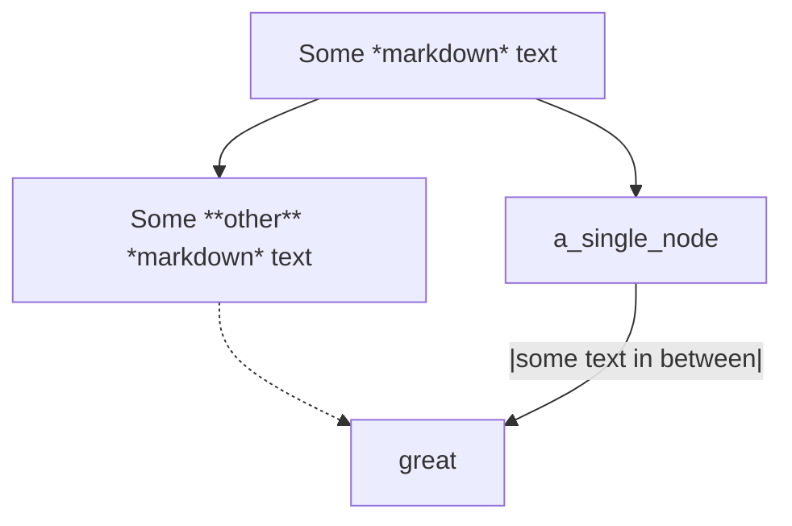

# Suggested Tools and Setup

I'm an AI engineer with a PhD and years of experience developing in several languages, but mostly python (most of the AI runs on python and C++). Throughout the years I've accumulated experience using more and more convenient tools, solving issues I never imagined I would have. This guide is both for me and anyone reading this to save themselves some time when starting up either as a new beginner developer or an experienced one who just bought a new computer or did a clean install of their OS and needs to start all over again (happens more often than I'd like to admit).

## Terminal

When developing, most of your time will be spent on either your text editor / IDE, or your terminal executing code. It is therefore important to choose a good one that integrates well into your workflow.

Personally, when I started development on Ubuntu about 15 years ago, I wasn't too aware of this and the default gnome terminal was enough for me, although I did customize it a little. Then, when I moved over to MacOSX, my goal was to make my development environment as close to Ubuntu as possible. It was then that I started finding better options since the default terminal in MacOSX had zero customization and the color theme was awful on my eyes. Once finding better options, I found myself using features that I never used in Linux. Finally, when I moved to Windows because of my job requirements and also at home, for gaming, I found the OS to be truly disgusting, and the native development tools to be absolutely horrid. However, most of that stopped mattering when I found [WSL (Windows Subsystem for Linux)](https://ubuntu.com/desktop/wsl), I could run all my commands within a contained Linux environment, and all that I had to do on the Windows side was have my editor open (which is cross-platform). Then, on my free time, I could game without issues or partitioning memory drives, etc. (Although Windows 11 is frustrating enough that this might change).

I quickly realized that I needed a good Terminal setup to approximate the workflow I had on MacOSX.

Here are my recommendations:

### Windows Terminal with Cmder, Git Bash, and WSL profiles

It comes pre-installed, but compared to the pre-installed MacOSX terminal, it pretty much has all the functions that you need for customizing it to your taste, and the capability to run behind the scenes with better software than it initially has (looking at you, PowerShell). It also is **not [Electron](https://www.electronjs.org/apps) based**, which makes it **lightweight and fast** in comparison to other bloated options based in Electron. Don't use Electron for things where speed is paramount, please.

I will split this in three sections:

1) [Cmder](https://cmder.app/): Having an actually usable command prompt for Windows commands combined with a few essential sh commands.
2) [Git Bash](https://gitforwindows.org/): Having a local (still technically within windows OS) bash shell for every other command you need.
3) [WSL](https://www.groovypost.com/howto/install-windows-subsystem-for-linux-in-windows-11/): Access the Windows Subsystem for Linux within the Windows Terminal correctly

#### Windows Terminal + Cmder

[Cmder](https://cmder.app/) is a powerful combination of `cmd`, Clink, ConEmu and Git Bash that actually makes working with Windows commands bearable. However, I prefer to use the Windows Terminal as an interface. We can combine both by assigning a new profile to Windows Terminal pointing to the installed Cmder.

[Here's a pretty thorough guide for that](https://medium.com/talpor/windows-terminal-cmder-%EF%B8%8F-573e6890d143)

Besides the manual starting directory `D:\git\` I personalized, the guide is pretty complete.

#### Windows Terminal + Git Bash

Download and Install from [The Git for Windows website](https://gitforwindows.org/)

I used most of the suggestions on installation, except for a few exceptions. Here's the options I chose:

- Check all the check-marks at the beginning to have right click menus for GitBash and shortcuts in the Windows pane.
- Make sure to install GitLFS along with the installation.
- Associate `.sh` and `.git` files with GitBash
- Use **Nano** editor as default
- Override the `master` branch to `main`
- When prompted to the **Adjusting your PATH environment window** : choose **Use Git from the command line and also 3rd party software**
- Use Bundled OpenSSH
- Use OpenSSL
- When choosing line-endings: **Checkout windows, commit Unix-style line endings**
- Use MinTTY
- Choose the default behavior of `git pull` as `fast-forward only`
- Do not use Git credential manager (later I will add SSH configs)
- Enable file system caching
- Enable pseudo consoles

Now click **Install** and wait for the installation to finish.

Follow the [Git Setup and Customization](./Git-Setup-and-Customization.md) for more.

What's also good about this setup is that it will add a Windows Terminal profile.

Then, I setup my starting directory `D:\git\`

#### Windows Terminal + WSL

Reference:
- [How to install Windows Subsystem for Linux in Windows 11](https://www.groovypost.com/howto/install-windows-subsystem-for-linux-in-windows-11/)


1. Open the cmd with administrator privileges
2. `wsl --install`
3. Restart computer
4. Make username under new Linux terminal

Then, setup a new profile for WSL on Windows Terminal:

1) Settings
2) Add a new profile
3) Name: `Ubuntu`
4) Command line `C:\Windows\system32\wsl.exe -d Ubuntu --exec bash -l`
5) Starting directory: `/mnt/d/git/`
6) Icon: `https://assets.ubuntu.com/v1/49a1a858-favicon-32x32.png`

And it should work!

So, there's a few points to clarify:

- Paths in WSL referring to the Windows disks can be found under `/mnt/` as mounted volumes.
- Make sure it's the `C:\Windows\system32\wsl.exe -d Ubuntu` and not the `ubuntu.exe`, because they will behave differently under Windows Terminal
- The original command `C:\Windows\system32\wsl.exe -d Ubuntu` does not open an additional bash, [leaving you in a login shell instead of an interactive shell](./Windows-Setup.md#wsl-about-profile-and-bash_profile). However, we can change the initial command that starts bash at startup to get the interactive shell automatically.

```cmd
C:\Windows\system32\wsl.exe -d Ubuntu --exec bash -l
```

This way, there's no need to edit the profile files.

Also, do refer to my [Windows Setup guide: WSL section](./Windows-Setup.md#wsl-windows-subsystem-for-linux-installation-guide), since there are a few peculiarities in proxy environments.

#### Windows Terminal + SSH server

When developing, it will be common that the main work is all done over a Linux server with a GPU, and that the main Windows PC is just used for editing the files.

To access the SSH server over a new profile, we can run the startup command like this:

```cmd
C:/Program Files/Git/bin/bash.exe -i -l -c 'ssh USER@HOST:PORT'
```

The host can also be added to the `.ssh/config` file:

```
# @ ~/.ssh/config 
Host linux_server
    HostName xxx.xx.x.xx
    Port xxx
    User xxxx
    RequestTTY force
    RemoteCommand cd your/path/here; bash -l

```

Then, the command can be:

```cmd
C:/Program Files/Git/bin/bash.exe -i -l -c 'ssh USER@linux_server'
```


#### Windows Terminal themes

I found this pretty comprehensive free [Windows Terminal themes collection](https://windowsterminalthemes.dev/).

To implement a theme, all you have to do is copy the JSON code, then open Windows Terminal, go under Settings, then the lower left corner must have a `Open JSON file` button, which points to the actual Windows Terminal configuration file, where you can paste the themes where appropriate (alongside other themes, and remember to check that the commas match)

### iTerm2 for MacOSX

[iTerm2](https://iterm2.com/) is my go to terminal emulator for MacOSX. It allows for customization, auto-complete, split panes, and many other features and it mimics well functions that Linux / Unix developers already know by heart.

Here's [an extensive collection of iTerm2 color schemes](https://iterm2colorschemes.com/) as well, to make it pretty.

As for the profiles, I find that I only ever needed to keep an `alias` for the SSH connection, and not a whole new terminal profile.

To do that I would add the aliases to `~/.bash_aliases` file, which is sourced in `~/.bashrc`.

For example:

```sh
# @ shell(mac_osx)
alias ssh_server="ssh -p {PORT} {USERNAME}@{HOST_IP_ADDRESS}"
```

Which again, can be shortened with the appropriate entry on `~/.ssh/config`

### GNU Terminal for Linux

As I mentioned before, I pretty much started my development journey on Linux and had to move to other OS because of external factors, or non-negotiable compatibility issues on things other than developing. However, due to my lack of experience, I pretty much only used the default gnome-terminal, [customized it to my liking](https://itsfoss.com/customize-linux-terminal/), and used multiplexers like [screen](https://git.savannah.gnu.org/cgit/screen.git/tree/src/README) to simulate split panes functionality (although multiplexers proved to be a little more complex than that).

I've seen chatter about newer terminal emulators, like Terminator or Kitty, but I haven't tested any of them myself, so I can't recommend one. However, the gnome terminal got me really far, and had most of the features I found on iTerm2 later down the line.


## Environment and CLI tools

For python related CLI tools, see [Python Setup](./Python-Setup.md).

For web development specifically, see [Web Development Setup](./Web-Development-Setup.md).

## IDE / Editors

### Sublime Text

[Sublime Text](https://www.sublimetext.com/) has been my go-to text editor for development, academic writing, hobby writing, and just about any writing ever.

I don't even use Word for PDFs, but rather would use Sublime Text and LaTeX to compile a PDF when absolutely necessary for some reason.

It is great for many reasons:

- Useful split panes for multiple files, or split view of different sections of the same file
- I get to edit multiple lines at once
- Shows definitions of functions
- Multi-language syntax highlighting, and syntax specific auto-completions save a lot of time.
- Has a save-state of the opened code even if you haven't saved a file (life-saver in crashes)
- Robust find and replace functions
- Has about as many open-source plugins written in Python with cool capabilities as you can think of.
- I can copy paste the settings whenever I get a new machine or environment!
- I can copy paste the license as well, which makes it really easy to setup.

But *most importantly*, unlike other editors (VSCode I'm looking at you), it is not based on [Electron](https://www.electronjs.org/apps), making it **absurdly lightweight and fast** in comparison. 

#### Install Sublime Text

- [SublimeText Windows and MacOSX download](https://www.sublimetext.com/download)
- [SublimeText Linux Repositories](https://www.sublimetext.com/docs/linux_repositories.html)

```sh
# @ shell(linux/wsl)

wget -qO - https://download.sublimetext.com/sublimehq-pub.gpg | gpg --dearmor | sudo tee /etc/apt/trusted.gpg.d/sublimehq-archive.gpg

sudo apt-get update
sudo apt-get install sublime-text
```

#### Setup SublimeText

Sublime Text is all about the plugins. 

Install Package Control by typing `CTRL+Shift+P`, then typing `Install Package Control`.

Then here's some cool packages to try:

- [Alignment](https://packagecontrol.io/packages/Alignment)
    - Perfect to align texts in docstrings or markdown tables
- [AutoFoldCode](https://packagecontrol.io/packages/AutoFoldCode)
- [ConvertToUTF8](https://packagecontrol.io/packages/ConvertToUTF8)
- [Dockerfile Syntax Highlighting](https://packagecontrol.io/packages/Dockerfile%20Syntax%20Highlighting)
- [EasyDiff](https://packagecontrol.io/packages/EasyDiff)
    - This is extremely useful for development memo taking
    - However, if accessing the repository over ssh it can take a long time
        - Disable the git checks with the setting: `{"git_disabled":true,}`
- [Fold Python](https://packagecontrol.io/packages/Fold%20Python)
- [IncrementSelection](https://packagecontrol.io/packages/Increment%20Selection)
    - When selecting several instances of the same number, increases by 1 each selection. 
    - Useful to make numbered rows in a text or CSV file.
    - Useful to turn unnumbered lists into numbered lists in Markdown documents
- [LaTeXTools](https://packagecontrol.io/packages/LaTeXTools)
    - [Automatically insert list patterns](https://tex.stackexchange.com/a/85487)
    - Can build PDFs from Sublime directly
    - Smart command completion for text and math commands
    - Word counts, and more
- [Markdown Code Blocks](https://packagecontrol.io/packages/Markdown%20Code%20Blocks)
- [MarkdownCodeBlockWrapper](https://packagecontrol.io/packages/MarkdownCodeBlockWrapper)
    - Select code, shortcut, now it has the ` back-tick wrapping
- [MarkdownEditing](https://packagecontrol.io/packages/MarkdownEditing)
- [MarkdownPreview](https://packagecontrol.io/packages/MarkdownPreview)
- [MarkdownTOC](https://packagecontrol.io/packages/MarkdownTOC)
- [RainbowCSV](https://packagecontrol.io/packages/rainbow_csv)
- [Advanced CSV](https://packagecontrol.io/packages/Advanced%20CSV)
- [PackageResourceViewer](https://packagecontrol.io/packages/PackageResourceViewer)
- [Paste as One Line](https://packagecontrol.io/packages/Paste%20as%20One%20Line)
- [Python Pretty Print](https://packagecontrol.io/packages/Python%20Pretty%20Print)
    - Haven't tried it on Sublime Text yet, but `pprint` is something I use frequently on python. Sounds promising.
- [Selection Evaluator](https://packagecontrol.io/packages/Selection%20Evaluator)
- [SublimeLinter](https://packagecontrol.io/packages/SublimeLinter)
- [TOML](https://packagecontrol.io/packages/TOML)- Adds syntax highlight for TOML files

<!-- - [Invert Current Color Scheme](https://packagecontrol.io/packages/Invert%20Current%20Color%20Scheme) -->
<!--    - Last supported on Sublime Text 2. Stopped working on Sublime Text 3, we are at Sublime Text 4 now. -->
<!-- Now, for the Invert Current Color Scheme, I have my own fork that works with Sublime Text 4, so use the PackageResourceViewer to replace the main python file with my code:
https://github.com/elisa-aleman/sublime-invert-current-color-scheme 

Except I never got the invert theme to work
-->
You could also [Make and submit your own package](https://packagecontrol.io/docs/submitting_a_package) if you have a good idea for a plugin.


In `MarkdownTOC.sublime-settings`, paste the following for hyperlink markdowns and compatibility with MarkdownPreview:

```jsonc
{
  "defaults": {
    "autoanchor": true,
    "autolink": true,
    "markdown_preview": "github",
    "uri_encoding": false
  },
}
```

After installing Markdown Editing, paste these Sublime Text 4 preferences (my personal preferences)

```jsonc
{
    "ignored_packages":
    [
        "Vintage",
    ],
    "spell_check": true,
    "tab_size": 4,
    "translate_tabs_to_spaces": true,
    "copy_with_empty_selection": false,
    "mde.auto_fold_link.enabled": false,
}
```

I also make Makefile files from time to time, and they don't allow the use of spaces instead of tabs, however I prefer to use spaces instead of tabs on Python.

So to add a syntax specific setting:

1) Open a new file
2) Change syntax to Makefile with `CTRL+SHIFT+P` then type `Makefile` and click on `Set Syntax: Makefile`
3) Preferences -> Settings - Syntax Specific
4) Paste the following

```jsonc
{
    "translate_tabs_to_spaces": false,
}
```

save and close

#### Easy TeX math: Add paired $ signs to the keybinds

I found myself needing paired \$dollar signs\$ for math expressions in either LaTeX, GitLab with KeTeX or GitHub also with a different syntax but still some interpretation of TeX.

Searching for [how to do it on macros](https://forum.sublimetext.com/t/snippet-wrap-current-line-or-selection/53285), I found [this post about keybindings](https://stackoverflow.com/questions/34115090/sublime-text-2-trying-to-escape-the-dollar-sign) which is a way better solution.

Which, as long as we implement the double escaped dollar sign solution, we can use freely.

I then also added `{ "key": "selector", "operator": "equal", "operand": "source.text.tex" },` and `{ "key": "selector", "operator": "equal", "operand": "text.html.markdown" },` to the above solution, so that this only gets implemented in the languages I use dollar sign pairing.

- Preferences > Key Bindings:
- Add this inside the brackets:

```jsonc
[
    // Auto-pair dollar signs on TeX or LaTeX
    { "keys": ["$"], "command": "insert_snippet", "args": {"contents": "\\$$0\\$"}, "context":
        [
            { "key": "selector", "operator": "equal", "operand": "source.text.tex" },
            { "key": "setting.auto_match_enabled", "operator": "equal", "operand": true },
            { "key": "selection_empty", "operator": "equal", "operand": true, "match_all": true },
            { "key": "following_text", "operator": "regex_contains", "operand": "^(?:\t| |\\)|]|\\}|>|$)", "match_all": true },
            { "key": "preceding_text", "operator": "not_regex_contains", "operand": "[\\$a-zA-Z0-9_]$", "match_all": true },
            { "key": "eol_selector", "operator": "not_equal", "operand": "string.quoted.double", "match_all": true }
        ]
    },
    { "keys": ["$"], "command": "insert_snippet", "args": {"contents": "\\$${0:$SELECTION}\\$"}, "context":
        [
            { "key": "selector", "operator": "equal", "operand": "source.text.tex" },
            { "key": "setting.auto_match_enabled", "operator": "equal", "operand": true },
            { "key": "selection_empty", "operator": "equal", "operand": false, "match_all": true }
        ]
    },
    { "keys": ["$"], "command": "move", "args": {"by": "characters", "forward": true}, "context":
        [
            { "key": "selector", "operator": "equal", "operand": "source.text.tex" },
            { "key": "setting.auto_match_enabled", "operator": "equal", "operand": true },
            { "key": "selection_empty", "operator": "equal", "operand": true, "match_all": true },
            { "key": "following_text", "operator": "regex_contains", "operand": "^\\$", "match_all": true }
        ]
    },
    { "keys": ["backspace"], "command": "run_macro_file", "args": {"file": "Packages/Default/Delete Left Right.sublime-macro"}, "context":
        [
            { "key": "selector", "operator": "equal", "operand": "source.text.tex" },
            { "key": "setting.auto_match_enabled", "operator": "equal", "operand": true },
            { "key": "selection_empty", "operator": "equal", "operand": true, "match_all": true },
            { "key": "preceding_text", "operator": "regex_contains", "operand": "\\$$", "match_all": true },
            { "key": "following_text", "operator": "regex_contains", "operand": "^\\$", "match_all": true }
        ]
    },
    // Auto-pair dollar signs on Markdown for github
    { "keys": ["$"], "command": "insert_snippet", "args": {"contents": "\\$$0\\$"}, "context":
        [
            { "key": "selector", "operator": "equal", "operand": "text.html.markdown" },
            { "key": "setting.auto_match_enabled", "operator": "equal", "operand": true },
            { "key": "selection_empty", "operator": "equal", "operand": true, "match_all": true },
            { "key": "following_text", "operator": "regex_contains", "operand": "^(?:\t| |\\)|]|\\}|>|$)", "match_all": true },
            { "key": "preceding_text", "operator": "not_regex_contains", "operand": "[\\$a-zA-Z0-9_]$", "match_all": true },
            { "key": "eol_selector", "operator": "not_equal", "operand": "string.quoted.double", "match_all": true }
        ]
    },
    { "keys": ["$"], "command": "insert_snippet", "args": {"contents": "\\$${0:$SELECTION}\\$"}, "context":
        [
            { "key": "selector", "operator": "equal", "operand": "text.html.markdown" },
            { "key": "setting.auto_match_enabled", "operator": "equal", "operand": true },
            { "key": "selection_empty", "operator": "equal", "operand": false, "match_all": true }
        ]
    },
    { "keys": ["$"], "command": "move", "args": {"by": "characters", "forward": true}, "context":
        [
            { "key": "selector", "operator": "equal", "operand": "text.html.markdown" },
            { "key": "setting.auto_match_enabled", "operator": "equal", "operand": true },
            { "key": "selection_empty", "operator": "equal", "operand": true, "match_all": true },
            { "key": "following_text", "operator": "regex_contains", "operand": "^\\$", "match_all": true }
        ]
    },
    { "keys": ["backspace"], "command": "run_macro_file", "args": {"file": "Packages/Default/Delete Left Right.sublime-macro"}, "context":
        [
            { "key": "selector", "operator": "equal", "operand": "text.html.markdown" },
            { "key": "setting.auto_match_enabled", "operator": "equal", "operand": true },
            { "key": "selection_empty", "operator": "equal", "operand": true, "match_all": true },
            { "key": "preceding_text", "operator": "regex_contains", "operand": "\\$$", "match_all": true },
            { "key": "following_text", "operator": "regex_contains", "operand": "^\\$", "match_all": true }
        ]
    },
]

```


#### Easily transform 2 spaced indent to 4 spaced indent

Sometimes you might come across a repository with a great piece of code that uses a different indentation style than yours. Sublime helps to change this very easily.

1) Sublime text, lower right corner
2) Click on Spaces
3) Select the current space number
4) Click Convert indentation to Tabs
5) Select the desired space number
6) Click Convert indentation to Spaces

### Sublime Merge

Whereas I used to only do command line git commits most of the time for years on end, [Sublime Merge](https://www.sublimemerge.com/) came out in 2018, where it went unnoticed for a while, and ignored since I was so used to the command line. But recently I rediscovered it, realized all the benefits it can add to my workflow and helped me also stop using Git Bash only for committing. Now I can focus all my terminal use on WSL if I'm working in Windows. This is a non-issue in Linux, however.

Sublime Merge allows you to see the commit history in a more understandable way, allows you to examine the difference in files before staging anything, and generally provides a more complete way to write good and comprehensive commit messages for the future developers trying to figure out just what changed. I have had my run of very backwards compatibility breaking changes having just a single line describing the commit, too many times. I will try to not contribute to that in the future.

It also allows you to blame specific lines of code, or to cherry pick lines of code! This last one is one that I can't wait to use at some point.

Also, installing it will provide extra functionality within Sublime Text when the two are connected.

So in summary:
- Better visualization of the commit history
- Easy diff view
- Allows you to craft better commit messages


## Documents and Planning

### Mermaid for Markdown code block graphs and diagrams

[Mermaid](https://mermaid.js.org/) is a GitHub and GitLab compatible diagram and graph JavaScript compiler that can be added to documentation with simple Markdown code blocks.

In README.md files, or any markdown document in a repository, it is compatible to insert most graphs (but not all) directly into the document like so:

`````Markdown

`````

Which renders as:


There's tons of options for different diagrams. My favorite are:

- Flowcharts
- Sequence Diagrams
- Class Diagrams
- Gitgraph Diagram
- Gantt charts

If you would rather see your work as you write it, there is the `mermaid-cli` and the [Mermaid Sublime Text Plugin](https://packagecontrol.io/packages/Mermaid). See details about installing it in the [Web Development Setup:Mermaid CLI](./Web-Development-Setup.md#Mermaid-CLI)

But I would rather just use the [Mermaid Live Editor](https://mermaid.live) since it provides me with the option to get example graphs, export graphs, and most importantly, generate copy-paste links for incompatible graph types.

As I said before, not all the types of diagrams are executed in GitHub or GitLab, but the links work regardless if you paste it in a document, inside an issue, in a comment on GitHub on an Issue discussion, or even in some chats that execute markdown such as Slack or Typetalk.

### markmap for great looking markdown mindmaps

[markmap](https://markmap.js.org/) is for markdown diagram generation everything mermaid lacked for the mindmaps.

They look great, but have less copy-paste in-document availability than I'd like.

For example, they're not codeblock based, but rather take an entire document, and they can be downloaded as an interactive HTML, which, good luck embedding that.

However, I think it's still a good tool for isolated uses.

### GitHub/GitLab flavored markdown math

#### GitHub Markdown math expressions for README.md, etc.

Following this guide, [math is different in GitLab markdown](https://docs.gitlab.com/ee/user/markdown.html#math) than say, GitHub or LaTeX.
However, inside of the delimiters, it renders it using KaTeX, which uses LaTeX math syntax! 

Inline: 
```tex
$a^2 + b^2 = c^2$
```

Renders as: $a^2 + b^2 = c^2$

Block:
```tex
$$a^2 + b^2 = c^2$$
```

Renders as:

$$a^2 + b^2 = c^2$$

But it only supports one line of math, so for multiple lines you have to do this:

```tex
$$a^2 + b^2 = c^2$$

$$c = \sqrt{ a^2 + b^2 }$$
```

The line break is important!!

Renders as:

$$a^2 + b^2 = c^2$$

$$c = \sqrt{ a^2 + b^2 }$$

It can even display matrices and the like:

```tex
$$
l_1 = 
\begin{bmatrix}
    \begin{bmatrix}
        x_1 & y_1
    \end{bmatrix} \\
    \begin{bmatrix}
        x_2 & y_2
    \end{bmatrix} \\
    ... \\
    \begin{bmatrix}
        x_n & y_n
    \end{bmatrix} \\
\end{bmatrix}
$$
```

$$
l_1 = 
\begin{bmatrix}
    \begin{bmatrix}
        x_1 & y_1
    \end{bmatrix} \\
    \begin{bmatrix}
        x_2 & y_2
    \end{bmatrix} \\
    ... \\
    \begin{bmatrix}
        x_n & y_n
    \end{bmatrix} \\
\end{bmatrix}
$$


However, `%` comments will break the environment, so it's not fully tex.

See more:
- [Math syntax in LaTeX: Katex supported documentation](https://katex.org/docs/supported.html):


#### GitLab Markdown math expressions for README.md, etc.

Following this guide, math is different in GitLab markdown than say, GitHub or LaTeX.
However, inside of the delimiters, it renders it using KaTeX, which uses LaTeX math syntax! 

https://docs.gitlab.com/ee/user/markdown.html#math

Inline: 
```Markdown
$`a^2 + b^2 = c^2`$
```

Renders as: $`a^2 + b^2 = c^2`$

Block:
````Markdown
```math
a^2 + b^2 = c^2
```
````

Renders as:

```math
a^2 + b^2 = c^2
```

But it only supports one line of math, so for multiple lines you have to do this:

````Markdown
```math
a^2 + b^2 = c^2
```
```math
c = \sqrt{ a^2 + b^2 }
```
````

Renders as:

```math
a^2 + b^2 = c^2
```
```math
c = \sqrt{ a^2 + b^2 }
```

It can even display matrices and the like:

````Markdown
```math
l_1 = 
\begin{bmatrix}
    \begin{bmatrix}
        x_1 & y_1
    \end{bmatrix} \\
    \begin{bmatrix}
        x_2 & y_2
    \end{bmatrix} \\
    ... \\
    \begin{bmatrix}
        x_n & y_n
    \end{bmatrix} \\
\end{bmatrix}
```
````

```math
l_1 = 
\begin{bmatrix}
    \begin{bmatrix}
        x_1 & y_1
    \end{bmatrix} \\
    \begin{bmatrix}
        x_2 & y_2
    \end{bmatrix} \\
    ... \\
    \begin{bmatrix}
        x_n & y_n
    \end{bmatrix} \\
\end{bmatrix}
```

However, `%` comments will break the environment.

See more:
- [Math syntax in LaTeX: Katex supported documentation](https://katex.org/docs/supported.html):


### LaTeX for documentation / reports

I use [LaTeX](https://www.latex-project.org/) for writing detailed reports, curriculum vitae documents, resumes, academic publication history, or cover letters. The files are way lighter than whatever mess you can make with other word editors, and it gives me precise control over how the document will look in the end.

For every installation method described below, a few other useful packages aside from just LaTeX along with it, including `latexdiff` which I used a lot to compare revisions on academic papers, or `bibtex` for bibliography parsing, among others.

#### Installation

##### LaTeX on Windows

Because I'm used to Unix systems already, the most usable packaging that offers that similarity across systems seems to be [TeXLive](https://tug.org/texlive/windows.html).

[Download the installer](https://mirror.ctan.org/systems/texlive/tlnet/install-tl-windows.exe) and run:

Make sure default paper is A4.

Now after installation you might get some install failures for a few packages, and will get a command with `tlmgr` and some options to run. That command can only be run in the CMD prompt and not in Git Bash.

This should also include `latexdiff`.

I recommend running latex in git bash for version control.

If you need to configure Tex Live using `tlmgr`, it's necessary to run the commands in the CMD prompt. However, `pdflatex` as well as `bibtex` run normally in git bash, so feel free to use the same git bash for both compiling and version control.

##### LaTeX on MacOSX

Download the `.pkg` file and install it manually from the [mactex download website](https://www.tug.org/mactex/downloading.html)

It is installed under `/Library/TeX/texbin`, but if you have any terminal sessions open it will probably not load, so you should open a new session.

##### LaTeX on Linux

The installation on Linux is straight-forward:

The specific package for LaTeX on linux has different versions depending on how many of the accompanying packages you wish to install. [You can read about the differences here](https://tex.stackexchange.com/questions/245982/differences-between-texlive-packages-in-linux). I prefer `texlive-latex-extra`, one step below the largest installation of them all.

```sh
# @ shell(linux/wsl) (debian)
sudo apt-get install texlive-latex-extra
sudo apt-get install latexdiff

# @ shell(linux/wsl) (arch)
pacman -S \
    texlive-latexextra \
    texlive-binextra \
    texlive-fontsrecommended \
    texlive-fontsextra
```

Latexdiff is contained in `texlive-binextra` in the case of arch linux.

##### Confirm install

Confirm that it installed with:

```sh
# @ shell(linux/mac_osx/wsl)
which pdflatex
which xelatex
which latexdiff

```

And so on for the relevant packages.

#### Use my LaTeX helper shell scripts for faster compilation

Source:
- [LaTeX helpers](https://github.com/elisa-aleman/latex_helpers)

I made these shell scripts to help in compiling faster when using bibliographies and to delete cumbersome files when not necessary every time I compile. Since they are .sh scripts, they run normally with git bash or the enhanced cmder on windows and run natively on shells in Linux and MacOSX.

Personally, I find it tiring to try to compile a LaTeX document, only to have to run the bibliography, and then compile the document twice again so all the references are well put where they need to be, rather tiring. Also, I find that the output files are cluttering my space and I only need to see them when I run into certain errors.

Also, for academic papers, I used `latexdiff` commands quite a lot, and while customizable, I noticed I needed a certain configuration for most journals and that was it.

So I made [LaTeX helpers](https://github.com/elisa-aleman/latex_helpers), a couple of bash scripts that make that process faster.

So instead of typing

```sh
# @ shell(linux/mac_osx/wsl)

pdflatex paper.tex
bibtex paper
pdflatex paper.tex
pdflatex paper.tex
open paper.tex
rm paper.log paper.out paper.aux paper.... and so on
```

Every. Single. Time. 

I just need to type:

```sh
# @ shell(linux/mac_osx/wsl)

./latexcompile.sh paper.tex --view --clean
```

and if I needed to make a latexdiff I just:

```sh
# @ shell(linux/mac_osx/wsl)

./my_latexdiff.sh paper_V1-1.tex paper.tex --newversion="2" --compile --view --clean
```

And there it is, a latexdiff PDF right on my screen.

I would also commonly have several documents of different languages, or save my latexdiff command in another script, called `cur_compile_all.sh` or `cur_latexdiff.sh` so I didn't have to remember version numbers and stuff when working across several weeks or months.

Usually with code such as:

```sh
# @ compile_langs.sh

SCRIPT=$(realpath "$0")
SCRIPTPATH=$(dirname "$SCRIPT")
latexcompile=$SCRIPTPATH/latexcompile.sh

INFILE="$1"
DOCNAME="${INFILE%.*}"
echo "Compiling with ${latexcompile} for languages en, es, jp: $@"

cd en && $latexcompile "$@"; cd ..
cd es && $latexcompile "$@"; cd ..
cd jp && $latexcompile "$@"; cd ..
```

So then I can just call


```sh
# @ shell(linux/mac_osx/wsl)

./compile_langs.sh my_document -x -v -c
```

And so on. 


#### Make LaTeX easier in Sublime Text:

- Install Package Control.
    - Install Package Control by typing `CTRL+Shift+P`, then typing `Install Package Control`.
- Install [LaTeXTools](https://packagecontrol.io/packages/LaTeXTools) plugin.
    - [Automatically insert list patterns](https://tex.stackexchange.com/a/85487)
    - Can build PDFs from Sublime directly
    - Smart command completion for text and math commands
    - Word counts, and more

#### XeLaTeX in Japanese

For Japanese UTF-8 text in XeLaTeX:

``` tex
\usepackage{xeCJK}
```

Set the fonts: these are the default, but they have no bold
```tex
\setCJKmainfont{IPAMincho} % No bold, serif
\setCJKsansfont{IPAGothic} % No bold, sans-serif
\setCJKmonofont{IPAGothic} % No bold, sans-serif
```

Installing fonts, for example, Aozora mincho has guaranteed bold

https://web.archive.org/web/20200321102301/http://blueskis.wktk.so/AozoraMincho/download.html 

Make sure to install for all users:

https://stackoverflow.com/questions/55264642/how-to-force-win10-to-install-fonts-in-c-windows-fonts

Set the installed font:

```tex
\setCJKmainfont[BoldFont=AozoraMincho-bold,AutoFakeSlant=0.15]{Aozora Mincho}
```

Japanse document style:

```tex
\usepackage[english,japanese]{babel} % For Japanese date format
\usepackage{indentfirst} % For Japanese style indentation
\setlength\parindent{11pt}
```

Japanese babel messes itemize up inside tables, so:

```tex
\usepackage{enumitem}
\newlist{jpcompactitemize}{itemize}{1} % defined new list
\setlist[jpcompactitemize]{topsep=0em, itemsep=-0.5em, label=\textbullet} % new list setup
```


In the end, my Japanese document setup looks like this:

```tex
% !TeX program = XeLaTeX
% !TeX encoding = UTF-8

\documentclass[11pt]{article} % or whatever you like for your document

% For Japanese UTF-8 text in XeLaTeX
\usepackage{xeCJK}
% \setCJKmainfont{IPAMincho} % No bold
% \setCJKsansfont{IPAGothic} % No bold
% \setCJKmonofont{IPAGothic} % No bold
%%% Installing fonts
% https://launchpad.net/takao-fonts 
% \setCJKmainfont{TakaoMincho} % still no bold but now it recognizes it
%%% Aozora mincho has guaranteed bold
% https://web.archive.org/web/20200321102301/http://blueskis.wktk.so/AozoraMincho/download.html 
% https://stackoverflow.com/questions/55264642/how-to-force-win10-to-install-fonts-in-c-windows-fonts (install for all users)
\setCJKmainfont[BoldFont=AozoraMincho-bold,AutoFakeSlant=0.15]{Aozora Mincho}

\usepackage[english,japanese]{babel} % For Japanese date format
\usepackage{csquotes}
\usepackage{indentfirst} % For Japanese style indentation
\setlength\parindent{11pt}
```

#### Display code sections in LaTeX

```tex
%%%%%%%%%%%%%%%%%%%%%%%%%%%%%%%%%%%%%%%%
%%%%%%%%%%%%%%%%%%%%%%%%%%%%%%%%%%%%%%%%
%%%%%%%%%%%%%%%%%%%%%%%%%%%%%%%%%%%%%%%%
\usepackage[lighttt]{lmodern}
\usepackage{listings} % to display code
\usepackage{lstautogobble} % to indent inside latex without affecting the code, keeping the indent the code has inside
\usepackage{anyfontsize} % for code font size
\usepackage[os=win]{menukeys} % to display keystrokes

% For the color behind the code sections:
\usepackage{xcolor} %custom colours
\definecolor{light-gray}{gray}{0.95} %the shade of grey that stack exchange uses
\definecolor{editorGreen}{rgb}{0, 0.5, 0} % #007C00 -> rgb(0, 124, 0)

% Make a more defined languages for nice colors
\include{lststyle-css.sty}
\include{lststyle-html5.sty}

% Set up the code display lst options
\lstset{
    % for the code font and size:
    % basicstyle=\ttfamily\small,
    basicstyle=\ttfamily\fontsize{10}{12}\selectfont,
    % to avoid spaces showing as brackets in strings
    showstringspaces=false,
    % for straight quotes in code
    upquote=true, 
    % for the middle tildes in the code
    literate={~}{{\fontfamily{ptm}\selectfont \textasciitilde}}1,
    % for the line break in long texts
    breaklines=true,
    postbreak=\mbox{\textcolor{red}{$\hookrightarrow$}\space}, 
    % for the keyword colors in the code
    keywordstyle=\color{blue}\bfseries\ttfamily,
    stringstyle=\color{purple},
    commentstyle=\color{darkgray}\ttfamily,
    keywordstyle={[2]{\color{editorGreen}\bfseries\ttfamily}},
    autogobble=true % to ignore latex indents but keep code indent
}

% unnecessary in XeLaTeX
% % For this specific document with lots of degree signs inside listings
% \lstset{
%     literate={°}{\textdegree}1
% }

% for straight double quotes in code
\usepackage[T1]{fontenc}

% frame set up
\usepackage[framemethod=TikZ]{mdframed} %nice frames
\mdfsetup{
    backgroundcolor=light-gray,
    roundcorner=7pt,
    leftmargin=1,
    rightmargin=1,
    innerleftmargin=1em,
    innertopmargin=0.5em,
    innerbottommargin=0,
    outerlinewidth=1,
    linecolor=light-gray,
    } 

% Make it affect all lstlistings
\BeforeBeginEnvironment{lstlisting}{\begin{mdframed}\vskip-.5\baselineskip}
\AfterEndEnvironment{lstlisting}{\end{mdframed}}

% Make colored box around inline code
\usepackage{realboxes}
\usepackage{xpatch}

\makeatletter
\xpretocmd\lstinline{\Colorbox{light-gray}\bgroup\appto\lst@DeInit{\egroup}}{}{}
\makeatother

%%%%%%%%%%%%%%%%%%%%%%%%%%%%%%%%%%%%%%%%
%%%%%%%%%%%%%%%%%%%%%%%%%%%%%%%%%%%%%%%%
%%%%%%%%%%%%%%%%%%%%%%%%%%%%%%%%%%%%%%%%
```


### Install Pandoc to convert/export markdown, HTML, LaTeX, Word

I discovered this tool recently when I was asked to share a PDF of my private GitLab MarkDown notes. Of course I wouldn't share the whole repository so that it can be displayed in GitLab for them, so I searched for an alternative. 

It can be installed in Windows, macOS, Linux, ChromeOS, BSD, Docker, ... it's really portable

Sources:
- [Pandoc Install](https://pandoc.org/installing.html)
- [Pandoc Manual](https://pandoc.org/MANUAL.html)


Export to PDF syntax
```sh
# @ shell(linux/mac_osx/wsl)

pandoc test1.md -s -o test1.pdf
```

Note that it uses LaTeX to convert to PDF, so UTF-8 languages (japanese, etc.) might return errors.

```sh
# @ shell(linux/mac_osx/wsl)

pandoc test1.md -s -o test1.pdf --pdf-engine=xelatex
```

But it doesn't load the Font for Japanese... Also, the default margins are way too wide.

So, in the original markdown file preamble we need to add [Variables for LaTeX](https://pandoc.org/MANUAL.html#variables-for-latex):

```Markdown
---
title: "Title"
author: "Name"
date: YYYY-MM-DD
# add the following 
geometry: margin=1.5cm
output: pdf_document
# CJKmainfont: IPAMincho #default font but no bold
# install this one for bold japanese: https://web.archive.org/web/20200321102301/http://blueskis.wktk.so/AozoraMincho/download.html
# https://stackoverflow.com/questions/55264642/how-to-force-win10-to-install-fonts-in-c-windows-fonts (install for all users)
CJKmainfont: Aozora Mincho
CJKoptions:
- BoldFont=AozoraMincho-bold
- AutoFakeSlant=0.15
---
```

And voilà, the markdown is now a PDF.

I'm still unsure if it will process the GitHub or GitLab math environments, since the syntax is different.

Upon confirmation with the [User's Guide: Math](https://pandoc.org/MANUAL.html#math) section, it uses the GitHub math syntax.

Inline: `$x=3$`  
Renders as:  
$x=3$


Block:  `$$x=3$$`  
Renders as:  
$$x=3$$

## Shell Scripting for convenience

When it comes down to it, specially when working with LaTeX or git, you find yourself making the same commands over and over again. That takes time and frustration, so I find that making scripts from time to time saves me a lot of time in the future.

### Basic flag setup with getopts

Once in a while those scripts will need some input to be more useful in as many cases as possible instead of a one time thing.

Looking for how to do this I ran across [a simple StackOverflow question](https://stackoverflow.com/questions/14447406/bash-shell-script-check-for-a-flag-and-grab-its-value), which led me to the `getopts` package and its tutorial:

Source:
- [getopts manual](https://archive.ph/TRzn4)

This is a working example:

```sh
while getopts ":a:" opt; do
  case $opt in
    a)
      echo "-a was triggered, Parameter: $OPTARG" >&2
      ;;
    \?)
      echo "Invalid option: -$OPTARG" >&2
      exit 1
      ;;
    :)
      echo "Option -$OPTARG requires an argument." >&2
      exit 1
      ;;
  esac
done

```


### Argparse-bash by nhoffman

Now sometimes you'll want to have fancy arguments with both a shortcut name `-` and a long name `--`, for example `-a` and `--doall` both pointing to the same command. In that case I recommend using nhoffman's implementation of Python's `argparse` in bash:

Source:
- [argparse.bash by nhoffman on GitHub](https://github.com/nhoffman/argparse-bash)


## Accessibility Tools

### Accessible Color Palettes with Paletton

When designing new things it's important to keep in mind color theory, as well as accessibility for the visually impaired and color blind people, etc. But that's so much time one could spend doing so much else, so here's a tool that can help with that and also visualizing how other people with different ranges of color vision would perceive it. It's called [Paletton](https://paletton.com).


### Reading tools for Neurodivergent people

There was a new tool developed called "Bionic Reading", which bolds the beginnings of words so that our eyes glide over them more easily, basically making a tool for speed reading without having to train specifically for that. Lots of neurodivergent people such as myself (I have ADHD and am autistic), have a hard time following long texts or focusing when there is too much information at the same time (say, with very small line spacing). This new tool has been praised by the ND (neurodivergent) community, since making it available for businesses or companies to use would mean more accessibility in everyday services...  or at least it was until they decided to charge an OUTRAGEOUS amount of money to implement it, making it obviously not attractive for companies to implement and therefore ruining it for everyone.

That is why someone decided to make "[Not Bionic Reading](https://not-br.neocities.org/)" which is, legally speaking, not the same thing as Bionic Reading and therefore can be made available for everyone as Open Source.

Source:
- [Not Bionic Reading](https://not-br.neocities.org/)
- [not-br on GitHub](https://github.com/axoletl/not-br)

Have fun reading!

### Dark Reader

[Dark Reader](https://darkreader.org/) is an extension for your browser that 

### Reading white PDFs


#### Firefox

References:
- [Dark mode for Firefox's built-in PDF viewer](https://pncnmnp.github.io/blogs/firefox-dark-mode.html)

> After hunting on the web for about 30 minutes, I found this thread on Bugzilla. It turns out starting with Firefox 60, extensions are no longer allowed to interact with the native pdf viewer. Determined, I decided to locally modify the CSS rendered by Firefox's PDF viewer. The steps for the same are:
>
> - Open Firefox and press Alt to show the top menu, then click on Help → Troubleshooting Information
> - Click the Open Directory button beside the Profile Directory entry
> - Create a folder named chrome in the directory that opens
> - In the chrome folder, create a CSS file with the name `userContent.css`
> - Open the `userContent.css` file and insert -

```css
#viewerContainer > #viewer .page > .canvasWrapper > canvas {
    filter: grayscale(100%);
    filter: invert(100%);
    background-color: #000 !important;
}
```

> - On Firefox's URL bar, type about:config.
> - Search for toolkit.legacyUserProfileCustomizations.stylesheets and set it to true.
> - Restart Firefox and fire up a PDF file to see the change!


#### Microsoft Edge

If you ever need to read a PDF on the Microsoft Edge browser, you can create a snippet to execute on the Dev Console, as per [this post](https://www.reddit.com/r/edge/comments/nhnflv/comment/hgejdwz/?utm_source=share&utm_medium=web2x&context=3).

> So, I've wanted this feature pretty badly as well and I've found a workaround which doesn't involve inverting the whole OS but still takes some extra steps:
>
> 1. Open the PDF you want to read
> 2. Right click > Inspect Element
> 3. Select Console tab
> 4. Paste the code given below
> 5. Hit enter
> 6. Profit!


```js
let backgroundColor = PDFViewer.EDGE_PDFVIEWER_BACKGROUND_COLOR_LIGHT;
viewer.plugin_.setAttribute('background-color', backgroundColor);
viewer.pluginController_.postMessage({
    type: 'backgroundColorChanged',
    backgroundColor
});
document.getElementById('document-container').style.filter = 'invert()';
document.getElementById('layout-container').style.filter = 'invert()';
```

> You can utilize the snippets feature in DevTools to save the above code. To do that, do:
> 
> 1. Hit F12 or Ctrl + Shift + I to open DevTools
> 2. Once the DevTools is open, press Ctrl + Shift + P and type "new snippet" and choose the first option
> 3. Paste the above code
> 4. Right click "Script snippet #2" > Rename > "dark mode pdf"
> 5. Hit enter to rename
> 6. Close DevTools
> 
> If you did the above to save that script, the next time, you can perform the following steps to activate dark mode:
> 
> 1. Open PDF
> 2. Right click > Inspect Element
> 3. Press Ctrl + P
> 4. Type exclamation "!"
> 5. Hit enter (or select the snippet if you have multiple and press enter)


#### Google Chrome

I found a solution in [this post](https://superuser.com/a/1527417).

> The following snippet adds a div overlay to any browser tab currently displaying a PDF document.
> 1. Open up your browser's Dev tools then browser console.
> 2. Paste this JavaScript code in your browser console:

```
const overlay = document.createElement("div");

const css = `
    position: fixed;
    pointer-events: none;
    top: 0;
    left: 0;
    width: 100vw;
    height: 100vh;
    background-color: white;
    mix-blend-mode: difference;
    z-index: 1;
`
overlay.setAttribute("style", css);

document.body.appendChild(overlay);
```

> 3. Hit Enter
>
> Special thanks: https://www.reddit.com/r/chrome/comments/e3txhi/comment/fem1cto

 